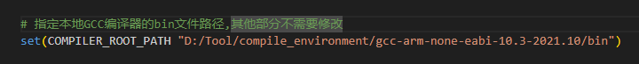
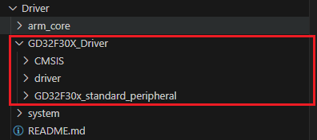
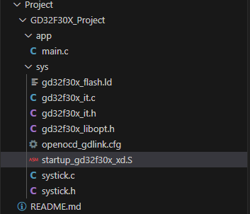
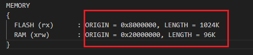

# 以使用GD32F30X点亮一个LED为例

## 1. 准备工作(请确保已经下载安装好相关工具)
 - 在顶层目录下的toolchain.cmake文件中指定编译器路径,如图所示:
 - 

## 2. 添加平台驱动
 - 在Driver目录下创建新的目录代表一个平台的驱动，例如 GD32F30X_Driver，并在该目录下添加半导体厂商提供的驱动文件
 - 新建一个driver文件夹未来在此文件下添加特定设备驱动,如图所示:
 - 


## 3. 在Peoject目录下创建新的目录，例如 GD32F30X_Project，并在该目录下添加工程文件
 - 新建app文件夹 存放所有的应用程序
 - 新建sys文件夹 存放中断处理文件,链接文件,启动文件等,如图所示:
 - 

 - GD32官方提供的链接文件需要修改顶部部分为自己芯片型号的FLASH与RAM大小,如图所示:
 - 

## 4. 提供一个定时器用于系统调度
### 实现Driver/system/platform_schedule.c中的三个接口
    1. 实现_stimer_base_init函数，根据参数period初始化定时器，并保存f_timeout回调指针到stimer_cb变量
    2. 实现_stimer_base_start函数，启动定时器
    3. 在中断中调用stimer_cb函数，处理定时器中断
    4. 以下代码仅供参考:
``` C
#include "gd32f30x.h"

/* 请勿修改接口定义 */
static void _stimer_base_init(uint32_t period, stimer_timeout_process f_timeout)
{
    /*   实现定时器的初始化操作 period : 周期 , f_timeout : 中断回调函数  */

    rcu_periph_clock_enable(RCU_TIMER1);

    timer_parameter_struct task_timer;
    timer_deinit(TIMER1);

    task_timer.alignedmode = TIMER_COUNTER_EDGE;
    task_timer.clockdivision = TIMER_CKDIV_DIV1;
    task_timer.counterdirection = TIMER_COUNTER_UP;
    task_timer.prescaler = (120 - 1); /* 120MHz时钟分频到1MHz */
    task_timer.period = (1000 * period) - 1; /* period传进来是1 每1ms触发一次中断 */
    task_timer.repetitioncounter = 0;
    timer_init(TIMER1, &task_timer);
    timer_flag_clear(TIMER1, TIMER_INT_UP);
    timer_interrupt_enable(TIMER1, TIMER_INT_UP);
    nvic_irq_enable(TIMER1_IRQn, 0, 1);

    stimer_cb = f_timeout;
}

/* 请勿修改接口定义 */
static void _stimer_base_start(void)
{
    /*   实现定时器的启动操作 */
    timer_enable(TIMER1);
}

/* 实现平台中断处理函数,在中断处理函数中调用stimer_cb回调函数 */
void TIMER1_IRQHandler(void)
{
    if (timer_interrupt_flag_get(TIMER1, TIMER_INT_FLAG_UP) != RESET) {
        if (stimer_cb)
            stimer_cb();
        timer_interrupt_flag_clear(TIMER1, TIMER_INT_FLAG_UP);
    }
}
```

## 5. 在Driver/GD32F30X_Driver/driver目录下添加LED驱动文件
 - 参考 [Driver/README.md](../../Driver/README.md) 中提供的驱动模版
 - 新建led_driver.c文件， 实现LED驱动函数,以下代码仅供参考:
``` C
#include "sys.h" /* 必要的头文件 */
#include "device.h" /* 必要的头文件 */

/* 导入芯片头文件 */
#include "gd32f30x.h"

static const char led_name[] = "led"; /* 确保此设备名唯一 */
static drv_err_e led_open(drv_file_t *file);
static drv_err_e led_close(drv_file_t *file);
static drv_err_e led_ioctrl(drv_file_t *file, int cmd, void *arg);
static int led_read(drv_file_t *file, uint8_t *buf, size_t len);
static int led_write(drv_file_t *file, const uint8_t *buf, size_t len);
static int led_lseek(drv_file_t *file, int offset, drv_lseek_whence_e whence);

static drv_err_e led_open(drv_file_t *file)
{
	if (file->is_opened)
		return DRV_ERR_OCCUPIED;

	file->is_opened = true;

	/* 外设初始化 */
	rcu_periph_clock_enable(RCU_GPIOE);
	gpio_init(GPIOE, GPIO_MODE_OUT_PP, GPIO_OSPEED_50MHZ, GPIO_PIN_5);

	file->dev_size = 0; /* 设备大小 可选 存储类设备需要 */

	return DRV_ERR_NONE;
}

static drv_err_e led_close(drv_file_t *file)
{
	/* 关闭外设 例如进入低功耗 */

	file->is_opened = false;

	return DRV_ERR_NONE;
}

static drv_err_e led_ioctrl(drv_file_t *file, int cmd, void *arg)
{
	if (!file->is_opened)
		return DRV_ERR_UNAVALIABLE;

	/* 除读写外的控制命令处理 */

	return DRV_ERR_NONE;
}

static int led_read(drv_file_t *file, uint8_t *buf, size_t len)
{
	if (!file->is_opened)
		return DRV_ERR_UNAVALIABLE;

	/* 读取外设数据 */

	return 0; /* 读取成功返回实际读取的字节数 */
}

static int led_write(drv_file_t *file, const uint8_t *buf, size_t len)
{
	if (!file->is_opened)
		return DRV_ERR_UNAVALIABLE;

	/* 写入外设数据 */
	gpio_bit_write(GPIOE, GPIO_PIN_5, (*buf ? SET : RESET));

	return 0; /* 写入成功返回实际写入的字节数 */
}

static int led_lseek(drv_file_t *file, int offset, drv_lseek_whence_e whence)
{
	uint32_t cur_offset = file->seek_pos;
	uint32_t new_offset = 0;

	switch (whence) {
	case DRV_LSEEK_WHENCE_HEAD: /* 头 */
		new_offset = offset;
		break;

	case DRV_LSEEK_WHENCE_SET: /* 当前 */
		new_offset = cur_offset + offset;
		break;

	case DRV_LSEEK_WHENCE_TAIL: /* 尾 */
		new_offset = file->dev_size - 1 + offset;
		break;

	default:
		return DRV_ERR_INVALID; /* 无效的whence参数 */
	}

	if (new_offset >= file->dev_size || new_offset < 0)
		return DRV_ERR_INVALID; /* 偏移超出有效范围 */

	file->seek_pos = new_offset;

	return new_offset;
}

static drv_file_opts_t led_dev = {
	.close = led_close,
	.ioctrl = led_ioctrl,
	.lseek = led_lseek,
	.open = led_open,
	.read = led_read,
	.write = led_write,
};

void led_init(void)
{
	device_register(&led_dev, led_name);
}

EXPORT_DIRVER(led_init) //必须使用EXPORT_DIRVER宏导出驱动初始化函数
```

## 6. 添加LED应用代码,使用dal_opt.h头文件中提供的接口函数
 - 提供一个初始化函数与一个任务函数与任务的周期,以下内容仅供参考:
  
``` C
/* 头文件 app_led.h*/
#ifndef _APP_LED_H
#define _APP_LED_H

#include "dal.h"

#define APP_LED_TASK_PERIOD 100 /* 周期为100ms */

void app_led_init(void);
void app_led_task(void);

#endif

```

``` C
/* 源文件 app_led.c*/

#include "app_led.h"

static int fd = -1;

void app_led_init(void)
{
	fd = dal_open("/dev/led"); /* 所有注册的驱动设备都注册到/dev目录下 因此是/dev/led */
}


void app_led_task(void)
{
	static uint8_t level = 0; /* 电平初始值为1 */

    if(fd >= RESERVED_FDS)
	    dal_write(fd, &level, sizeof(level)); /* 写入设备 */

	level ^= 1; /* 翻转电平 */
}

```

## 7. 在主文件中将LED任务加入系统调度当中,参考以下代码:

``` C
#include "stimer.h" /* 系统调度头文件 */
#include "app_led.h" /* LED头文件 */

int main(void)
{
	stimer_task_create(app_led_init, app_led_task, APP_LED_TASK_PERIOD); /* 创建一个LED任务 每隔100ms执行一次 */

    stimer_start(); /* 启动系统调度 */

	return 0;
}

```

## 8. 新建CMake项目(以Vscode为例)
 - 在工程目录下新建CMakeLists.txt文件 配置项目,以下内容仅供参考:
``` Cmake
# CMake 最低版本要求
cmake_minimum_required(VERSION 3.20)

# CMake 策略
cmake_policy(SET CMP0123 NEW)

# 内核
set(CPU_CORE cortex-m4)
set(CMAKE_SYSTEM_PROCESSOR ${CPU_CORE})

# 导入VirtualOS框架
set(FRAMEWORK_ROOT_DIR ${CMAKE_SOURCE_DIR}/../..)
include(${FRAMEWORK_ROOT_DIR}/VirtualOS.cmake)

# 项目名 语言类型
project(Test C ASM)

# 目标文件路径
set(EXECUTABLE_OUTPUT_PATH ${CMAKE_BINARY_DIR}/output)

# 头文件
set(PROJECT_INCLUDE_DIRS
    ${FRAMEWORK_ROOT_DIR}/Project/GD32F30X_Project/app/
    ${FRAMEWORK_ROOT_DIR}/Project/GD32F30X_Project/sys/
    ${FRAMEWORK_ROOT_DIR}/Driver/GD32F30X_Driver/GD32F30X_standard_peripheral/Include/
    ${FRAMEWORK_ROOT_DIR}/Driver/GD32F30X_Driver/CMSIS/GD/GD32F30x/Include/
    ${FRAMEWORK_ROOT_DIR}/Driver/GD32F30X_Driver/driver/
)
include_directories(${PROJECT_INCLUDE_DIRS})

# 源文件
file(GLOB_RECURSE SUBPROJECT_SOURCES
    ${FRAMEWORK_ROOT_DIR}/Project/GD32F30X_Project/app/*.c
    ${FRAMEWORK_ROOT_DIR}/Project/GD32F30X_Project/sys/*.c
    ${FRAMEWORK_ROOT_DIR}/Driver/GD32F30X_Driver/GD32F30X_standard_peripheral/Source/*.c
    ${FRAMEWORK_ROOT_DIR}/Driver/GD32F30X_Driver/CMSIS/GD/GD32F30x/Source/*.c
    ${FRAMEWORK_ROOT_DIR}/Driver/GD32F30X_Driver/driver/*.c
    
)

# 启动文件和链接脚本
set(STARTUP_FILE ${FRAMEWORK_ROOT_DIR}/Project/GD32F30X_Project/sys/startup_gd32f30x_xd.S)
set(LINKER_SCRIPT ${FRAMEWORK_ROOT_DIR}/Project/GD32F30X_Project/sys/gd32f30x_flash.ld)

# 编译选项
set(COMPILER_FLAGS
    -mcpu=${CPU_CORE}
    -mthumb
    -mthumb-interwork
    -ffunction-sections
    -fdata-sections
    -fno-common
    -fmessage-length=0
)

# 链接选项
add_link_options(
    -Wl,-Map=${EXECUTABLE_OUTPUT_PATH}/${PROJECT_NAME}.map
    -Wl,--print-memory-usage
    -Wl,--gc-sections
    -mcpu=${CPU_CORE}
    -mthumb
    -mthumb-interwork
    -T ${LINKER_SCRIPT}
)

# 设置可执行文件
add_executable(${PROJECT_NAME} ${BASE_SOURCES} ${SUBPROJECT_SOURCES} ${STARTUP_FILE})

# 设置编译选项
target_compile_options(${PROJECT_NAME} PRIVATE ${COMPILER_FLAGS})

# 设置HEX 和 BIN 文件路径
set(HEX_FILE ${EXECUTABLE_OUTPUT_PATH}/${PROJECT_NAME}.hex)
set(BIN_FILE ${EXECUTABLE_OUTPUT_PATH}/${PROJECT_NAME}.bin)

add_custom_command(TARGET ${PROJECT_NAME} POST_BUILD
    COMMAND ${CMAKE_OBJCOPY} -Oihex $<TARGET_FILE:${PROJECT_NAME}> ${HEX_FILE}
    COMMAND ${CMAKE_OBJCOPY} -Obinary $<TARGET_FILE:${PROJECT_NAME}> ${BIN_FILE}
    COMMAND ${CMAKE_SIZE} --format=berkeley $<TARGET_FILE:${PROJECT_NAME}>
    COMMAND ${CMAKE_OBJDUMP} -h $<TARGET_FILE:${PROJECT_NAME}> > ${EXECUTABLE_OUTPUT_PATH}/${PROJECT_NAME}.sections
)
```

 - 打开终端,进入Project/GD32F30X_Project/目录
 - 输入命令: cmake -S. -B build -DCMAKE_BUILD_TYPE=Debug -G Ninja
 - 等待CMake生成项目文件

## 9. 编写编译脚本(以Vscode为例)
 - 在项目根目录下新建.vscode文件夹
 - 在.vscode文件夹下创建tasks.json文件,以下内容仅供参考:
``` json
{
    "version": "2.0.0",
    "tasks": [
        {
            "label": "CMake Build",
            "type": "shell",
            "command": "cmake",
            "args": [
                "--build",
                "."
            ],
            "options": {
                "cwd": "${workspaceFolder}/Project/GD32F30X_Project/build"
            },
            "group": {
                "kind": "build",
                "isDefault": true
            },
            "problemMatcher": []
        }
    ]
}

```

## 10. 编写调试脚本(以Vscode为例)
 - 在.vscode文件夹下创建launch.json文件,以下内容仅供参考:
``` json
// 使用JLink调试器调试程序
{
    "version": "0.2.0",
    "configurations": [
        {
            "name": "Cortex Debug",
            "cwd": "${workspaceFolder}",
            "executable": "${workspaceFolder}/Project/GD32F30X_Project/build/output/Test", /* 编译文件 */
            "request": "launch",
            "type": "cortex-debug",
            "runToEntryPoint": "main",
            "serverpath": "D:/JLink/JLinkGDBServerCL.exe", /* JLinkGDBServerCL.exe路径 */
            "servertype": "jlink",
            "device": "GD32F303ZGT6", /* 芯片型号 */
            "svdPath": "D:/Keil_Pro/EmbeddedBuilder_v1.4.1.23782/EmbeddedBuilder/plugins/com.gigadevice.resources_1.0.0.202406140948/svd/GD32L23x.svd", /* SVD文件路径 */
            "preLaunchTask": "CMake Build", /* 编译任务名 参考tasks.json文件 */
            "liveWatch": {
                "enabled": true,
                "samplesPerSecond": 1
            },
        }
    ]
}
```

```json
//使用OpenOCD调试程序
{
  "version": "0.2.0",
  "configurations": [
    {
      "name": "Cortex Debug",
      "cwd": "${workspaceFolder}",
      "executable": "${workspaceFolder}/Project/GD32F30X_Project/build/output/Test", /* 编译文件 */
      "request": "launch",
      "type": "cortex-debug",
      "runToEntryPoint": "main",
      "servertype": "openocd",
      "device": "GD32F303ZGT6", // 芯片型号
      "svdPath": "C:/vscode_embeded/EmbeddedBuilder_v1.4.1.23782/EmbeddedBuilder/plugins/com.gigadevice.resources_1.0.0.202406140948/svd/GD32F30x_XD.svd", /* SVD文件路径 */
      "liveWatch": {
        "enabled": true,
        "samplesPerSecond": 1
      },
      "configFiles": [
        "${workspaceFolder}/Project/GD32F30X_Project/sys/openocd_gdlink.cfg" /* openocd配置文件路径 */
      ],
      "interface": "swd",
      "showDevDebugOutput": "both",
      "toolchainPrefix": "arm-none-eabi",
      "preLaunchTask": "CMake Build" /* 编译任务名 参考tasks.json文件 */
    }
  ]
}
```

## 11. 编译烧写程序(以Vscode为例)
 - 点击左侧`Run and Debug`按钮开始编译下载调试程序