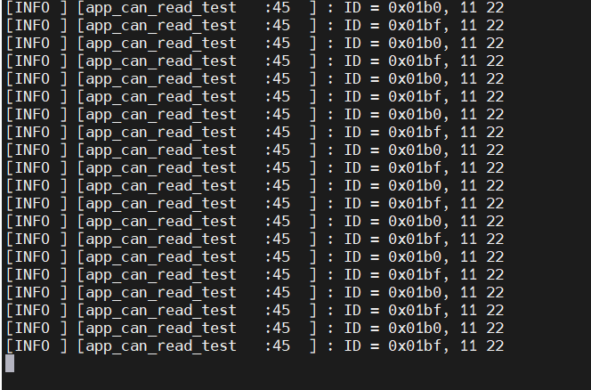

# 如何编写CAN应用与驱动

## 1. CAN帧定义
 - 在`include/driver/can_bus.h`中定义了标准CAN帧结构体，如下所示
```c
#define CAN_MAX_DLEN 8

/*
 * 控制器局域网 (CAN) 标识符结构
 *
 * bit 0-28 : CAN 标识符（11/29 位）
 * bit 29   : 错误帧标志（0 = 数据帧，1 = 错误消息帧）
 * bit 30   : 远程请求帧标志（1 = RTR 帧）
 * bit 31   : 帧格式标志（0 = 标准帧（11 位），1 = 扩展帧（29 位））
 */
typedef uint32_t canid_t;

#define CAN_STANDARD_ID_MASK 0x000007FF // CAN 标准帧标识符掩码
#define CAN_EXTENDED_ID_MASK 0x1FFFFFFF // CAN 扩展帧标识符掩码
#define CAN_ERR_FLAG 0x20000000			// 错误帧标志
#define CAN_RTR_FLAG 0x40000000			// 远程请求帧标志
#define CAN_EXT_FLAG 0x80000000			// 扩展帧标志

// CAN帧
struct can_frame {
	uint8_t data[CAN_MAX_DLEN]; // 数据内容
	canid_t can_id;				// CAN ID + 帧类型
	uint8_t can_dlc;			// 数据长度
};
```
 - 应用层调用读写接口时，只需要填充/解析`can_frame`结构体即可，驱动中也需要根据平台情况填充/解析CAN帧结构体。

## 2. 驱动编写
- 在项目自己新建的驱动文件中新建驱动文件， 如`can_driver.c`
- 参考[驱动模板](../driver/README.md)的编写方法
- 参考代码如下：
```c
#include <stdbool.h>
#include <stdint.h>
#include <string.h>

#include "driver/driver.h" /* 驱动注册头文件 */
#include "utils/queue.h"
#include "driver/can_bus.h"

#include "gd32f30x.h"

static const char can_name[] = "can0"; /* 确保此设备名项目中唯一 */
static int can_open(struct drv_file *file);
static int can_close(struct drv_file *file);
static int can_ioctl(struct drv_file *file, int cmd, void *arg);
static size_t can_read(struct drv_file *file, void *buf, size_t len, size_t *offset);
static size_t can_write(struct drv_file *file, void *buf, size_t len, size_t *offset);

struct can_device {
	bool check_over;			// 发送完成标志
	struct queue_info rx_queue; // 接收队列
};

#define RX_BUFFER_UNITS (12)								// 12条CAN帧缓冲
static struct can_frame rx_buffer[RX_BUFFER_UNITS] = { 0 }; // CAN帧接收缓冲
static struct can_device can_dev = {
	.check_over = true,
	.rx_queue = { 0 },
};

static int can_open(struct drv_file *file)
{
	if (file->is_opened)
		return DRV_ERR_OCCUPIED;

	/* 打开外设 */

	file->is_opened = true;

	return DRV_ERR_NONE;
}

static int can_close(struct drv_file *file)
{
	/* 关闭外设 例如进入低功耗 */

	file->is_opened = false;

	return DRV_ERR_NONE;
}

static int can_ioctl(struct drv_file *file, int cmd, void *arg)
{
	if (!file->is_opened)
		return DRV_ERR_UNAVAILABLE;

	/* 除读写外的控制命令处理 */

	int ret = DRV_ERR_INVALID;

#define CAN_CHECK_OVER_CMD (1) // 检查发送完成标志

	switch (cmd) {
	case CAN_CHECK_OVER_CMD:
		*(bool *)arg = can_dev.check_over;

		ret = DRV_ERR_NONE;
		break;

	default:
		ret = DRV_ERR_INVALID;
		break;
	}

#undef CAN_CHECK_OVER_CMD

	return ret;
}

// 转换CAN帧 将框架的CAN帧定义转为GD32的发送CAN帧
static void can_tx_msg_convert(can_trasnmit_message_struct *tx_msg, struct can_frame *frame)
{
	if (!frame || !tx_msg)
		return;

	memset(tx_msg, 0, sizeof(can_trasnmit_message_struct));

	tx_msg->tx_ff = (frame->can_id & CAN_EXT_FLAG) ? CAN_FF_EXTENDED : CAN_FF_STANDARD;
	tx_msg->tx_ft = (frame->can_id & CAN_RTR_FLAG) ? CAN_FT_REMOTE : CAN_FT_DATA;

	if (tx_msg->tx_ff == CAN_FF_STANDARD) {
		tx_msg->tx_sfid = frame->can_id & CAN_STANDARD_ID_MASK;
	} else {
		tx_msg->tx_efid = frame->can_id & CAN_EXTENDED_ID_MASK;
	}

	tx_msg->tx_dlen = frame->can_dlc;
	memcpy(tx_msg->tx_data, frame->data, frame->can_dlc);
}

// 转换CAN帧 将GD32的接收CAN帧转为框架的CAN帧定义
static void can_rx_msg_convert(struct can_frame *frame, can_receive_message_struct *rx_msg)
{
	if (!rx_msg || !frame)
		return;

	memset(frame, 0, sizeof(struct can_frame));

	if (rx_msg->rx_ff == CAN_FF_STANDARD) {
		// 标准帧
		frame->can_id = rx_msg->rx_sfid & CAN_STANDARD_ID_MASK; // 标准帧ID
	} else {
		// 扩展帧
		frame->can_id = rx_msg->rx_efid & CAN_EXTENDED_ID_MASK; // 扩展帧ID
		frame->can_id |= CAN_EXT_FLAG;							// 扩展帧标志
	}

	if (rx_msg->rx_ft == CAN_FT_REMOTE)
		frame->can_id |= CAN_RTR_FLAG; // 远程帧

	frame->can_dlc = rx_msg->rx_dlen;
	memcpy(frame->data, rx_msg->rx_data, rx_msg->rx_dlen);
}

// 中断接收
void USBD_LP_CAN0_RX0_IRQHandler(void)
{
	if (can_interrupt_flag_get(CAN0, CAN_INT_FLAG_RFL0) != RESET) {
		can_receive_message_struct receive_message;
		struct can_frame frame;
		can_message_receive(CAN0, CAN_FIFO0, &receive_message); // 读取CAN接收帧
		can_rx_msg_convert(&frame, &receive_message);			// 转为框架CAN帧
		queue_add(&can_dev.rx_queue, &frame, 1);				// 加入接收队列 后续读取
		can_interrupt_flag_clear(CAN0, CAN_INT_FLAG_RFL0);
	}
}

// 从队列中读取CAN帧
static size_t can_read(struct drv_file *file, void *buf, size_t len, size_t *offset)
{
	if (!file->is_opened || !can_dev.check_over)
		return 0;

	size_t real_frame_len = len / sizeof(struct can_frame); // 计算实际读取的帧数
	struct can_frame *frame = (struct can_frame *)buf;		// 框架CAN帧

	size_t read_units = 0;
	size_t units = 0;

	for (size_t i = 0; i < real_frame_len; i++) {
		units = queue_get(&can_dev.rx_queue, &frame[i], 1); // 这里的CAN帧是框架CAN帧 在中断接收时已经转换
		read_units += units;
	}

	return read_units * sizeof(struct can_frame); /* 读取成功返回实际读取的字节数 */
}

// 写入CAN帧
static size_t can_write(struct drv_file *file, void *buf, size_t len, size_t *offset)
{
	if (!file->is_opened)
		return 0;

	size_t real_frame_len = len / sizeof(struct can_frame); // 计算实际写入的帧数
	struct can_frame *frame = (struct can_frame *)buf;		// 框架CAN帧
	can_trasnmit_message_struct tx_msg;						// 平台CAN帧

	can_dev.check_over = false; // 伪锁

	for (size_t i = 0; i < real_frame_len; i++) {
		can_tx_msg_convert(&tx_msg, &frame[i]); // 框架CAN帧转为平台CAN帧
		can_message_transmit(CAN0, &tx_msg);
	}

	can_dev.check_over = true;

	return real_frame_len * sizeof(struct can_frame); // 返回实际写入的字节数
}

// 设备操作接口
static const struct file_operations can_opts = {
	.close = can_close,
	.ioctl = can_ioctl,
	.open = can_open,
	.read = can_read,
	.write = can_write,
};

// 设备驱动初始化
static bool can_driver_init(struct drv_device *dev)
{
	/* 外设初始化 */

	rcu_periph_clock_enable(RCU_CAN0);					   // CAN0
	rcu_periph_clock_enable(RCU_GPIOB);					   // GPIOB
	rcu_periph_clock_enable(RCU_AF);					   // 复用
	gpio_pin_remap_config(GPIO_CAN_PARTIAL_REMAP, ENABLE); // 重映射CAN0引脚

	gpio_init(GPIOB, GPIO_MODE_IPU, GPIO_OSPEED_50MHZ, GPIO_PIN_8);	  // PB8 RX
	gpio_init(GPIOB, GPIO_MODE_AF_PP, GPIO_OSPEED_50MHZ, GPIO_PIN_9); // PB9 TX

	can_deinit(CAN0);

	// 初始化CAN参数
	can_parameter_struct param;
	can_struct_para_init(CAN_INIT_STRUCT, &param);
	param.time_triggered = DISABLE;			  // 关闭时间触发
	param.auto_bus_off_recovery = ENABLE;	  // 开启自恢复
	param.auto_wake_up = DISABLE;			  // 关闭自动唤醒
	param.auto_retrans = ENABLE;			  // 开启自动重发
	param.rec_fifo_overwrite = DISABLE;		  // 关闭接收FIFO溢出
	param.trans_fifo_order = DISABLE;		  // 关闭发送FIFO顺序
	param.working_mode = CAN_LOOPBACK_MODE;	  // 回环模式 测试收发
	param.resync_jump_width = CAN_BT_SJW_1TQ; // 再同步补偿
	param.time_segment_1 = CAN_BT_BS1_5TQ;	  // 时间段1 这里5实际为4
	param.time_segment_2 = CAN_BT_BS2_4TQ;	  // 时间段2 这里4实际为3
	// 波特率 = APB1 / prescaler / (time_segment_1 + time_segment_2 + resync_jump_width) = 60M / 24 / (5 + 4 + 1) = 250k
	param.prescaler = 24;
	can_init(CAN0, &param);

	// 初始化CAN过滤器参数
	can_filter_parameter_struct filter;
	can_struct_para_init(CAN_FILTER_STRUCT, &filter);
	filter.filter_number = 0;				   // 过滤器号
	filter.filter_mode = CAN_FILTERMODE_MASK;  // 掩码模式
	filter.filter_bits = CAN_FILTERBITS_16BIT; // 掩码位宽
	filter.filter_list_low = 0x1B0 << 5;	   // 0X1Bx 都可以
	filter.filter_list_high = 0x1B0 << 5;	   // 0X1Bx 都可以
	filter.filter_mask_low = 0x7F0 << 5;	   // 0X1Bx 都可以
	filter.filter_mask_high = 0x7F0 << 5;	   // 0X1Bx 都可以
	filter.filter_fifo_number = CAN_FIFO0;	   // 接收FIFO0
	filter.filter_enable = ENABLE;			   // 使能过滤器
	can_filter_init(&filter);

	nvic_irq_enable(USBD_LP_CAN0_RX0_IRQn, 0, 0);
	can_interrupt_enable(CAN0, CAN_INT_RFNE0);

	// 12条CAN报文
	queue_init(&can_dev.rx_queue, sizeof(struct can_frame), rx_buffer, RX_BUFFER_UNITS); // 初始化接收队列

	return true;
}

// 通过宏定义导出驱动(在 virtual_os_init 函数中会被调用)
EXPORT_DRIVER(can_driver_probe)
void can_driver_probe(void)
{
	driver_register(can_driver_init, &can_opts, can_name); // 调用注册接口
}
```

## 3. 编写应用层代码
 - 在`app/src`文件夹中新建文件,如 `app_can.c`
 - 在`app/inc`文件夹中新建文件,如 `app_can.h`
 - 编写了串口驱动后，即可使用`VirtualOS/dal/dal_opt.h`中提供的接口,其中的每个
   接口都与驱动的`struct file_operations`一一对应
 - 使用框架定义的CAN帧进行收发
 - 参考代码如下：
```c
// app_can.h
#ifndef __APP_CAN_H__
#define __APP_CAN_H__

#define APP_CAN_TASK_PERIOD_MS (5)

void app_can_init(void);
void app_can_task(void);

#endif
```

```c
// app_can.c

#include "app_can.h"
#include "dal/dal_opt.h"
#include "driver/can_bus.h" // CAN帧
#include "utils/log.h"
#include <stdint.h>

struct app_can_dev {
	int fd;			  // 文件描述符
	const char *name; // 设备名
};

static struct app_can_dev app_can = {
	.fd = -1,
	.name = "can0",
};

// 发送测试代码
static void app_can_send_test(void)
{
	static uint32_t counter = 2000;
	if (counter < 2000) {
		counter += APP_CAN_TASK_PERIOD_MS;
		return;
	}
	counter = 0; // 每2s发送一次

	struct can_frame frame = { 0 }; // 定义CAN帧
	frame.can_dlc = 2;				// 发送2字节
	frame.data[0] = 0x11;
	frame.data[1] = 0x22;

	// 发送三个不同帧
	frame.can_id = 0x1B0;
	dal_write(app_can.fd, &frame, sizeof(struct can_frame));

	frame.can_id = 0x1BF;
	dal_write(app_can.fd, &frame, sizeof(struct can_frame));

	frame.can_id = 0x2B0;
	dal_write(app_can.fd, &frame, sizeof(struct can_frame));
}

// 接收测试代码 打印帧ID和数据
static void app_can_read_test(void)
{
	struct can_frame frame = { 0 };
	size_t len = dal_read(app_can.fd, &frame, sizeof(struct can_frame));
	if (len == sizeof(struct can_frame)) {
		log_i("ID = 0x%04x, %02x %02x\n", (frame.can_id & CAN_STANDARD_ID_MASK), frame.data[0], frame.data[1]);
	}
}

/********************API********************/

void app_can_init(void)
{
	app_can.fd = dal_open(app_can.name);
}

void app_can_task(void)
{
	app_can_send_test();

	app_can_read_test();
}
```

## 4. 在主函数中创建日志任务
 - 参考代码如下

```c
#include <stdint.h>
#include <stddef.h>

#include "utils/stimer.h"

#include "systick.h"

#include "app_can.h"

int main(void)
{
	app_system_init(); // 初始化VirtualOS和调度器

	stimer_task_create(app_log_init, app_log_task, APP_LOG_TASK_PERIOD_MS); // 创建日志任务
	stimer_task_create(app_can_init, app_can_task, APP_CAN_TASK_PERIOD_MS); // 创建CAN任务

	stimer_start(); // 启动调度器(死循环)
 
	return 0;
}
```

## 实验结果
 - 实现现象为只打印了CAN帧ID为0x1B0和0x1BF的帧，0X2B0的帧没有打印，不符合过滤器的设置。
 - 如图所示:
