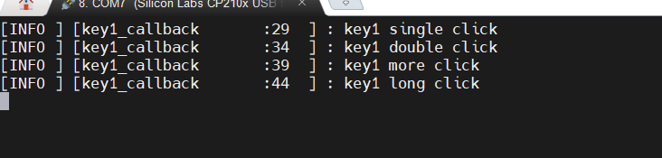

# 配置按键组件

## 使用本框架提供的按键组件，无死延时消抖，支持单击，双击，多击，长按

1. 编写按键驱动代码，即IO读取的驱动

- 在项目自己新建的驱动文件中新建驱动文件， 如`key_driver.c`
- 参考[驱动模板](../driver/README.md)的编写方法
- 参考代码如下：

```c
#include <stdbool.h>
#include <stdint.h>
#include "virtual_os_driver/virtual_os_driver.h" /* 驱动注册头文件 */

#include "gd32f30x.h"

static const char key_name[] = "key"; /* 确保此设备名项目中唯一 */
static int key_open(struct drv_file *file);
static int key_close(struct drv_file *file);
static int key_ioctl(struct drv_file *file, int cmd, void *arg);
static size_t key_read(struct drv_file *file, void *buf, size_t len, size_t *offset);
static size_t key_write(struct drv_file *file, void *buf, size_t len, size_t *offset);

static int key_open(struct drv_file *file)
{
	if (file->is_opened)
		return DRV_ERR_OCCUPIED;

	/* 打开外设 */

	file->is_opened = true;

	return DRV_ERR_NONE;
}

static int key_close(struct drv_file *file)
{
	/* 关闭外设 例如进入低功耗 */

	file->is_opened = false;

	return DRV_ERR_NONE;
}

static int key_ioctl(struct drv_file *file, int cmd, void *arg)
{
	if (!file->is_opened)
		return DRV_ERR_UNAVAILABLE;

	/* 除读写外的控制命令处理 */

	return DRV_ERR_NONE;
}

static size_t key_read(struct drv_file *file, void *buf, size_t len, size_t *offset)
{
	if (!file->is_opened)
		return DRV_ERR_UNAVAILABLE;

	uint8_t *p_buf = buf;

	/* 读取外设数据 */
	FlagStatus status = gpio_input_bit_get(GPIOE, GPIO_PIN_3); // 读取GPIOE3位状态
	if (status == RESET)
		p_buf[0] = 0;
	else
		p_buf[0] = 1;

	return 1; /* 读取成功返回实际读取的字节数 */
}

static size_t key_write(struct drv_file *file, void *buf, size_t len, size_t *offset)
{
	if (!file->is_opened)
		return DRV_ERR_UNAVAILABLE;

	return 0; /* 写入成功返回实际写入的字节数 */
}

// 设备操作接口
static const struct file_operations key_dev = {
	.close = key_close,
	.ioctl = key_ioctl,
	.open = key_open,
	.read = key_read,
	.write = key_write,
};

// 设备驱动初始化
static bool key_driver_init(struct drv_device *dev)
{
	/* 外设初始化 */
	rcu_periph_clock_enable(RCU_GPIOE);
	rcu_periph_clock_enable(RCU_AF);

	gpio_init(GPIOE, GPIO_MODE_IPU, GPIO_OSPEED_50MHZ, GPIO_PIN_3);

	return true;
}

// 通过宏定义导出驱动(在 virtual_os_init 函数中会被调用)
EXPORT_DRIVER(key_driver_probe)
void key_driver_probe(void)
{
	driver_register(key_driver_init, &key_dev, key_name); // 调用注册接口
}
```

### 2. 编写按键的应用代码

- 在`app/src`文件夹中新建文件,如 `app_key.c`
- 在`app/inc`文件夹中新建文件,如 `app_key.h`
- 编写了按键驱动后，即可使用`VirtualOS/dal/dal_opt.h`中提供的接口,其中的每个
接口都与驱动的`struct file_operations`一一对应
- 参考代码如下

```c
// app_key.h

#ifndef __APP_KEY_H__
#define __APP_KEY_H__

#define APP_KEY_TASK_PERIOD_MS (2)

void app_key_init(void);
void app_key_task(void);

#endif /* __APP_KEY_H__ */
```

```c
// app_key.c

#include <stdint.h>

#include "dal/dal_opt.h"

#include "utils/button.h" // 案件组件
#include "utils/log.h"	  // 日志组件

#include "app_key.h" // 头文件

#define KEY_NAME "key"	// 设备名
static int fd_key = -1; // 文件描述符

static btn_handle key_handle = NULL; // 按键实例

static uint8_t key_read(void)
{
	uint8_t level = 1;
	dal_read(fd_key, &level, sizeof(uint8_t)); // 读取按键状态
	return level;
}

static void key_callback(const struct btn_ev_data *ev_data)
{
	switch (ev_data->ev_type) {
	case USR_BTN_EV_SINGLE_CLICK:
		// 单击
		log_i("key single click\n");
		break;

	case USR_BTN_EV_DOUBLE_CLICK:
		// 双击
		log_i("key double click\n");
		break;

	case USR_BTN_EV_MORE_CLICK:
		// 多击
		log_i("key more click\n");
		break;

	case USR_BTN_EV_LONG_CLICK:
		// 长按
		log_i("key long click\n");
		break;
	default:
		break;
	}
}

static struct btn_cfg key_cfg = {
	.active_lv = BUTTON_LEVEL_LOW, // 低电平有效
	.f_io_read = key_read,		   // 按键读取函数
	.up_max_cnt = 100,			   // 单次按下之间的间隔(根据任务周期计算这里约(2 * 100)ms)
	.long_min_cnt = 1000,		   // 长按最小时间(根据任务周期计算这里约(2 * 1000)ms)
};

static void key_init(void)
{
	fd_key = dal_open(KEY_NAME);
	key_handle = button_ctor(&key_cfg, key_callback);
}

/******************API******************/

void app_key_init(void)
{
	key_init();
}

void app_key_task(void)
{
	button_scan(key_handle);
}
```

### 3. 新建按键任务

- 在main函数中新建任务，参考代码如下

```c
#include <stdint.h>
#include <stddef.h>

#include "utils/stimer.h"

#include "systick.h"

#include "app_key.h"

int main(void)
{
	app_system_init(); // 初始化VirtualOS和调度器

	stimer_task_create(app_key_init, app_key_task, APP_KEY_TASK_PERIOD_MS); // 创建按键任务

	stimer_start(); // 启动调度器(死循环)

	return 0;
}
```

### 4. 编译烧录后

当单击，双击，多击，长按按键时，会在串口打印相应的日志信息，效果如下

