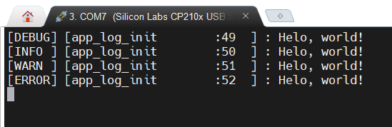

# 日志使用说明

## 本框架已经提供`utils/log.c`日志组件，只需要提供一个串口回调即可使用

### 1. 编写日志的串口驱动

- 在项目自己新建的驱动文件中新建驱动文件， 如`log_driver.c`
- 参考[驱动模板](../driver/README.md)的编写方法
- 本案例使用DMA+串口作为底层发送方式
- 参考代码如下：

```c
#include <stdbool.h>
#include <stdint.h>
#include <stdlib.h>
#include <string.h>

#include "driver/virtual_os_driver.h" /* 必要的头文件 */
#include "utils/queue.h"   /* 环形队列 */

#include "gd32f30x.h"

static const char syslog_name[] = "syslog"; /* 确保此设备名唯一 */
static int syslog_open(struct drv_file *file);
static size_t syslog_read(struct drv_file *file, void *buf, size_t len, size_t *offset);
static size_t syslog_write(struct drv_file *file, void *buf, size_t len, size_t *offset);

#define SYSLOG_TX_BUF_SIZE (512)
#define SYSLOG_RX_BUF_SIZE (256)

// 日志设备结构体
struct syslog_dev {
	uint8_t tx_buf[SYSLOG_TX_BUF_SIZE]; // 发送缓冲区
	uint8_t rx_buf[SYSLOG_RX_BUF_SIZE]; // 接收缓冲区
	struct queue_info rx_queue;			// 接收队列
	bool tx_over;						// 发送完成标志位
	bool is_opened;						// 打开标志位
	size_t pre_idx;						// DMA上一次索引
};

// 打开设备
static int syslog_open(struct drv_file *file)
{
	if (file->is_opened)
		return DRV_ERR_OCCUPIED;

	file->is_opened = true;

	return DRV_ERR_NONE;
}

// 关闭设备
static int syslog_close(struct drv_file *file)
{
	file->is_opened = false;

	return DRV_ERR_NONE;
}

// 获取发送完成状态
static int syslog_ioctl(struct drv_file *file, int cmd, void *arg)
{
	if (!file->is_opened)
		return DRV_ERR_UNAVAILABLE;

	struct syslog_dev *syslog = file->private; // 初始化的时候已经设置了私有数据这里可以直接拿到

	switch (cmd) {
	case 0:
		*(bool *)arg = syslog->tx_over;
		return DRV_ERR_NONE;
	default:
		return DRV_ERR_INVALID;
	}

	return DRV_ERR_NONE;
}

// 读数据
static size_t syslog_read(struct drv_file *file, void *buf, size_t len, size_t *offset)
{
	if (!file->is_opened)
		return DRV_ERR_UNAVAILABLE;

	struct syslog_dev *syslog = file->private; // 初始化的时候已经设置了私有数据这里可以直接拿到

	// DAM的Buffer就是队列初始化的Buffer，所以直接从队列中取数据即可

	return queue_get(&syslog->rx_queue, buf, len); /* 返回实际取到的数据长度 */
}

// 写数据
static size_t syslog_write(struct drv_file *file, void *buf, size_t len, size_t *offset)
{
	if (!file->is_opened)
		return DRV_ERR_UNAVAILABLE;

	struct syslog_dev *syslog = file->private; // 初始化的时候已经设置了私有数据这里可以直接拿到

	// 还在发送中直接返回
	if (!syslog->tx_over)
		return 0;

	syslog->tx_over = false; // 重新置为发送中

	// DMA发送数据
	memcpy(syslog->tx_buf, buf, len);
	dma_channel_disable(DMA0, DMA_CH3);
	dma_transfer_number_config(DMA0, DMA_CH3, len);
	dma_channel_enable(DMA0, DMA_CH3);

	return len; /* 返回实际发送的数据长度 */
}

// 设备操作接口
static const struct file_operations syslog_opts = {
	.close = syslog_close,
	.ioctl = syslog_ioctl,
	.open = syslog_open,
	.read = syslog_read,
	.write = syslog_write,
};

// DMA发送完成中断处理
void DMA0_Channel3_IRQHandler(void)
{
	static struct syslog_dev *syslog = NULL;
	if (syslog == NULL) {
		syslog = get_dev_private("syslog"); // 通过接口获取私有数据, 确保只查询一次
		if (syslog == NULL)
			return;
	}

	if (dma_interrupt_flag_get(DMA0, DMA_CH3, DMA_INT_FLAG_FTF) != RESET) {
		syslog->tx_over = true;

		dma_interrupt_flag_clear(DMA0, DMA_CH3, DMA_INT_FLAG_FTF);
	}
}

// USART接收超时中断处理
void USART0_IRQHandler(void)
{
	static struct syslog_dev *syslog = NULL;
	if (syslog == NULL) {
		syslog = get_dev_private("syslog"); // 通过接口获取私有数据, 确保只查询一次
		if (syslog == NULL)
			return;
	}

	if (usart_interrupt_flag_get(USART0, USART_INT_FLAG_RT) != RESET) {
		uint32_t remain_cnt = dma_transfer_number_get(DMA0, DMA_CH4);
		size_t cur_pos = SYSLOG_RX_BUF_SIZE - remain_cnt;
		size_t cur_receive; // 计算接收的数据长度

		if (cur_pos >= syslog->pre_idx)
			cur_receive = cur_pos - syslog->pre_idx;
		else
			cur_receive = SYSLOG_RX_BUF_SIZE - syslog->pre_idx + cur_pos; // 环形队列溢出

		queue_advance_wr(&syslog->rx_queue, cur_receive); // 更新队列的写指针
		syslog->pre_idx = cur_pos;

		usart_interrupt_flag_clear(USART0, USART_INT_FLAG_RT);
	}
}

// 设备驱动初始化
static bool syslog_driver_init(struct drv_device *dev)
{
	if (!dev)
		return false;

	struct syslog_dev *syslog = calloc(1, sizeof(struct syslog_dev)); // 申请结构体
	if (!syslog)
		return false;
	syslog->tx_over = true; // 发送完成标志位

	// 串口 + DMA 的初始化
	rcu_periph_clock_enable(RCU_GPIOA);
	gpio_init(GPIOA, GPIO_MODE_AF_OD, GPIO_OSPEED_50MHZ, GPIO_PIN_9);
	gpio_init(GPIOA, GPIO_MODE_IN_FLOATING, GPIO_OSPEED_50MHZ, GPIO_PIN_10);

	rcu_periph_clock_enable(RCU_USART0);
	usart_baudrate_set(USART0, 115200);
	usart_receive_config(USART0, USART_RECEIVE_ENABLE);
	usart_transmit_config(USART0, USART_TRANSMIT_ENABLE);
	usart_interrupt_enable(USART0, USART_INT_RT);		 /* 超时中断 */
	usart_receiver_timeout_enable(USART0);				 /* 使能接收超时 */
	usart_receiver_timeout_threshold_config(USART0, 10); /* 超时阈值设置10 */
	nvic_irq_enable(USART0_IRQn, 0, 0);
	usart_enable(USART0);

	rcu_periph_clock_enable(RCU_DMA0);
	dma_deinit(DMA0, DMA_CH3);
	dma_parameter_struct dma_param;
	dma_struct_para_init(&dma_param);
	dma_param.periph_addr = (uint32_t)(&USART_DATA(USART0));
	dma_param.periph_width = DMA_PERIPHERAL_WIDTH_8BIT;
	dma_param.memory_addr = (uint32_t)syslog->tx_buf;
	dma_param.memory_width = DMA_MEMORY_WIDTH_8BIT;
	dma_param.number = SYSLOG_TX_BUF_SIZE;
	dma_param.priority = DMA_PRIORITY_ULTRA_HIGH;
	dma_param.periph_inc = DMA_PERIPH_INCREASE_DISABLE;
	dma_param.memory_inc = DMA_MEMORY_INCREASE_ENABLE;
	dma_param.direction = DMA_MEMORY_TO_PERIPHERAL;
	usart_dma_transmit_config(USART0, USART_TRANSMIT_DMA_ENABLE);
	dma_init(DMA0, DMA_CH3, &dma_param);
	dma_interrupt_enable(DMA0, DMA_CH3, DMA_INT_FLAG_FTF);
	nvic_irq_enable(DMA0_Channel3_IRQn, 0, 1);

	dma_param.memory_addr = (uint32_t)syslog->rx_buf; // 接收缓冲
	dma_param.direction = DMA_PERIPHERAL_TO_MEMORY;
	dma_param.number = SYSLOG_RX_BUF_SIZE;
	dma_deinit(DMA0, DMA_CH4);
	dma_init(DMA0, DMA_CH4, &dma_param);
	dma_circulation_enable(DMA0, DMA_CH4); /* 使能环形缓冲 */
	usart_dma_receive_config(USART0, USART_RECEIVE_DMA_ENABLE);
	dma_channel_enable(DMA0, DMA_CH4);

	queue_init(&syslog->rx_queue, sizeof(uint8_t), syslog->rx_buf, SYSLOG_RX_BUF_SIZE); /* 初始化接收队列 */

	set_dev_private(dev, syslog); // 设置私有数据 以便于其他接口获取

	return true;
}

// 通过宏定义导出驱动(在 virtual_os_init 函数中会被调用)
EXPORT_DRIVER(syslog_driver_probe)
void syslog_driver_probe(void)
{
	driver_register(syslog_driver_init, &syslog_opts, syslog_name); // 调用注册接口
}
```

### 2. 编写日志的应用代码

- 在`app/src`文件夹中新建文件,如 `app_log.c`
- 在`app/inc`文件夹中新建文件,如 `app_log.h`
- 编写了串口驱动后，即可使用`VirtualOS/dal/dal_opt.h`中提供的接口,其中的每个
   接口都与驱动的`struct file_operations`一一对应
- 使用框架提供的日志组件, 只需要调用`syslog_init`函数即可，其中的参数分别为 读写回调和获取发送完成状态的回调和任务的周期
- 初始化完成之后则可以使用相关宏定义来打印日志, 如`log_d`, `log_i`, `log_w`, `log_e`
- 参考代码如下

```c
// app_log.h

#ifndef _APP_LOG_H
#define _APP_LOG_H

#define APP_LOG_TASK_PERIOD_MS (5) // 任务周期

void app_log_init(void); // 日志初始化
void app_log_task(void); // 日志任务

#endif /* _APP_LOG_H */
```

```c
// app_log.c

#include "dal/dal_opt.h" // 文件接口

#include "utils/log.h" // 日志组件

#include "app_log.h" // 头文件

static int fd = -1;

static size_t _log_write(uint8_t *buf, size_t len)
{
	return dal_write(fd, buf, len);
}

static size_t _log_read(uint8_t *buf, size_t len)
{
	return dal_read(fd, buf, len);
}

static bool _log_check_over(void)
{
	// 轮询发送直接返回true
	// DMA发送这里需要判断是否发送完成

	bool status = false;
	int err = DAL_ERR_NOT_EXIST; // 错误码

	int cmd = 0; // 驱动中的指令0为获取发送完成状态

	err = dal_ioctl(fd, cmd, &status);
	if (err != DAL_ERR_NONE)
		return false;

	return status;
}

static struct log_interface interface = {
	.check_over = _log_check_over,
	.write = _log_write,
	.read = _log_read,
};

void app_log_init(void)
{
	fd = dal_open("syslog"); // 打开日志设备

	syslog_init(&interface, APP_LOG_TASK_PERIOD_MS); // 初始化日志组件

	syslog_set_level(LOG_LEVEL_ALL); // 开启全等级日志

    // 打印日志
	log_d("Helo, world!\n");
	log_i("Helo, world!\n");
	log_w("Helo, world!\n");
	log_e("Helo, world!\n");
}

void app_log_task(void)
{
	syslog_task(); // 轮询日志组件的任务
}
```

### 3. 在主函数中创建日志任务

- 参考代码如下

```c
#include <stdint.h>

#include "utils/stimer.h"

#include "systick.h"

#include "app_log.h"

int main(void)
{
	app_system_init(); // 初始化VirtualOS和调度器

	stimer_task_create(app_log_init, app_log_task, APP_LOG_TASK_PERIOD_MS); // 创建日志任务

	stimer_start(); // 启动调度器(死循环)

	return 0;
}
```

### 4. 编译烧录

- 编译烧录后，串口终端显然的日志信息如下所示

- 其中 第一部分为日志等级，第二部分为日志所在的函数与行号，第三部分为日志内容
- 可以通过`syslog_set_level`来修改不同的日志等级
