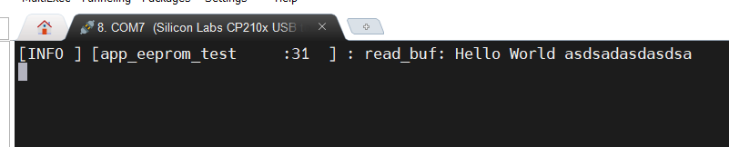

# 如何利用EEPROM使用文件偏移操作

## 介绍

- 在驱动中，读写接口都有一个文件偏移参数，该参数用于表示从存储设备的当前位置进行读写。
- 用户编写驱动接口时无需自行计算偏移，只需要在读写结束后更新文件偏移参数即可。
- 实际的文件偏移参数由框架自行管理，而当用户需要手动控制偏移时，需要调用`dal/dal_opts`中的`int dal_lseek`接口
- 记住每次应用层读写之后，文件偏移都会增加进行对应的读写长度

## 1. EEPROM驱动示例

- 在项目自己新建的驱动文件中新建驱动文件， 如`i2c_driver.c`
- 参考[驱动模板](../driver/README.md)的编写方法
- 参考代码如下：

```c
#include <stdbool.h>
#include <stdint.h>
#include "driver/virtual_os_driver.h" /* 驱动注册头文件 */
#include "gd32f30x.h"

static const char i2c1_name[] = "i2c1"; /* 确保此设备名项目中唯一 */
static int i2c1_open(struct drv_file *file);
static int i2c1_close(struct drv_file *file);
static int i2c1_ioctl(struct drv_file *file, int cmd, void *arg);
static size_t i2c1_read(struct drv_file *file, void *buf, size_t len, size_t *offset);
static size_t i2c1_write(struct drv_file *file, void *buf, size_t len, size_t *offset);

/*********************************EEPROM驱动*********************************/
/*------------------配置信息------------------*/
#define EEPROM_BLOCK_SIZE (256) /* EEPROM块大小 */
#define EEPROM_PAGE_SIZE (16)	/* EEPROM页大小 */
#define EEPROM_SIZE (2 * 1024)	/* EEPROM总容量 */

/**
 * @brief 根据偏移地址计算实际 I2C 地址
 *        对 AT24C16：共 8 块(0~7)，每块 256 字节。
 * @param offset [in] 全局偏移(0 ~ 2047)
 * @return 7-bit I2C 从机地址
 */
static inline uint8_t eeprom_calc_dev_addr(uint16_t offset, uint8_t dir)
{
	uint8_t block = (offset / EEPROM_BLOCK_SIZE) & 0x07; // 计算块号
	uint8_t dev_addr_7bit = (0b1010 << 3) | block;		 /* 7位地址 = 0b1010 << 3 | block  */
	return dev_addr_7bit << 1;
}

/**
 * @brief 计算块内地址(低8位)
 */
static inline uint8_t eeprom_calc_addr_in_block(uint16_t offset)
{
	return (uint8_t)(offset & 0xFF);
}

/*------------------等待写完成------------------*/
static void eeprom_wait_standby_state(uint8_t slave_addr)
{
	__IO uint32_t val = 0;

	while (1) {
		while (i2c_flag_get(I2C1, I2C_FLAG_I2CBSY))
			;

		i2c_start_on_bus(I2C1);
		while (!i2c_flag_get(I2C1, I2C_FLAG_SBSEND))
			;

		i2c_master_addressing(I2C1, slave_addr, I2C_TRANSMITTER);

		do {
			val = I2C_STAT0(I2C1);
		} while (0 == (val & (I2C_STAT0_ADDSEND | I2C_STAT0_AERR)));

		if (val & I2C_STAT0_ADDSEND) {
			i2c_flag_clear(I2C1, I2C_FLAG_ADDSEND);
			i2c_stop_on_bus(I2C1);
			while (I2C_CTL0(I2C1) & 0x0200)
				;
			return;
		} else {
			i2c_flag_clear(I2C1, I2C_FLAG_AERR);
		}

		i2c_stop_on_bus(I2C1);
		while (I2C_CTL0(I2C1) & 0x0200)
			;
	}
}

/**
 * @brief 写页
 * 
 * @param p_buffer 缓冲区
 * @param slave_addr 从机地址
 * @param addr_in_page 页内地址
 * @param number_of_byte 写入字节数
 */
static void eeprom_page_write(uint8_t *p_buffer, uint8_t slave_addr, uint8_t addr_in_page, uint8_t number_of_byte)
{
	while (i2c_flag_get(I2C1, I2C_FLAG_I2CBSY))
		;

	i2c_start_on_bus(I2C1);
	while (!i2c_flag_get(I2C1, I2C_FLAG_SBSEND))
		;

	i2c_master_addressing(I2C1, slave_addr, I2C_TRANSMITTER);
	while (!i2c_flag_get(I2C1, I2C_FLAG_ADDSEND))
		;
	i2c_flag_clear(I2C1, I2C_FLAG_ADDSEND);

	while (!i2c_flag_get(I2C1, I2C_FLAG_TBE))
		;

	i2c_data_transmit(I2C1, addr_in_page);
	while (!i2c_flag_get(I2C1, I2C_FLAG_BTC))
		;

	while (number_of_byte--) {
		i2c_data_transmit(I2C1, *p_buffer++);
		while (!i2c_flag_get(I2C1, I2C_FLAG_BTC))
			;
	}

	i2c_stop_on_bus(I2C1);
	while (I2C_CTL0(I2C1) & 0x0200)
		;
}

/**
 * @brief 写块
 * 
 * @param p_buffer 缓冲区
 * @param dev_addr 从机地址
 * @param block_address 块地址
 * @param number_of_byte 写入字节数
 */
static void eeprom_block_write(uint8_t *p_buffer, uint8_t dev_addr, uint8_t block_address, uint16_t number_of_byte)
{
	uint8_t address = block_address % EEPROM_PAGE_SIZE;
	uint8_t count = EEPROM_PAGE_SIZE - address;
	uint16_t number_of_page = number_of_byte / EEPROM_PAGE_SIZE;
	uint16_t number_of_single = number_of_byte % EEPROM_PAGE_SIZE;

	if (0 == address) {
		while (number_of_page--) {
			eeprom_page_write(p_buffer, dev_addr, block_address, EEPROM_PAGE_SIZE);
			eeprom_wait_standby_state(dev_addr);
			block_address += EEPROM_PAGE_SIZE;
			p_buffer += EEPROM_PAGE_SIZE;
		}
		if (number_of_single != 0) {
			eeprom_page_write(p_buffer, dev_addr, block_address, (uint8_t)number_of_single);
			eeprom_wait_standby_state(dev_addr);
		}
	} else {
		if (number_of_byte < count) {
			eeprom_page_write(p_buffer, dev_addr, block_address, (uint8_t)number_of_byte);
			eeprom_wait_standby_state(dev_addr);
		} else {
			number_of_byte -= count;
			number_of_page = number_of_byte / EEPROM_PAGE_SIZE;
			number_of_single = number_of_byte % EEPROM_PAGE_SIZE;

			eeprom_page_write(p_buffer, dev_addr, block_address, count);
			eeprom_wait_standby_state(dev_addr);

			block_address += count;
			p_buffer += count;

			while (number_of_page--) {
				eeprom_page_write(p_buffer, dev_addr, block_address, EEPROM_PAGE_SIZE);
				eeprom_wait_standby_state(dev_addr);
				block_address += EEPROM_PAGE_SIZE;
				p_buffer += EEPROM_PAGE_SIZE;
			}
			if (number_of_single != 0) {
				eeprom_page_write(p_buffer, dev_addr, block_address, (uint8_t)number_of_single);
				eeprom_wait_standby_state(dev_addr);
			}
		}
	}
}

/**
 * @brief 读块
 * 
 * @param p_buffer 缓冲区
 * @param dev_addr 从机地址
 * @param block_address 块地址
 * @param number_of_byte 读字节数
 */
static void eeprom_block_read(uint8_t *p_buffer, uint8_t dev_addr, uint8_t block_address, uint16_t number_of_byte)
{
	while (i2c_flag_get(I2C1, I2C_FLAG_I2CBSY))
		;

	if (number_of_byte == 2) {
		i2c_ackpos_config(I2C1, I2C_ACKPOS_NEXT);
	}

	i2c_start_on_bus(I2C1);
	while (!i2c_flag_get(I2C1, I2C_FLAG_SBSEND))
		;
	i2c_master_addressing(I2C1, dev_addr, I2C_TRANSMITTER);
	while (!i2c_flag_get(I2C1, I2C_FLAG_ADDSEND))
		;
	i2c_flag_clear(I2C1, I2C_FLAG_ADDSEND);

	while (!i2c_flag_get(I2C1, I2C_FLAG_TBE))
		;
	i2c_enable(I2C1);

	i2c_data_transmit(I2C1, block_address);
	while (!i2c_flag_get(I2C1, I2C_FLAG_BTC))
		;

	i2c_start_on_bus(I2C1);
	while (!i2c_flag_get(I2C1, I2C_FLAG_SBSEND))
		;
	i2c_master_addressing(I2C1, dev_addr, I2C_RECEIVER);
	while (!i2c_flag_get(I2C1, I2C_FLAG_ADDSEND))
		;
	i2c_flag_clear(I2C1, I2C_FLAG_ADDSEND);

	if (number_of_byte < 3) {
		i2c_ack_config(I2C1, I2C_ACK_DISABLE);
	}
	if (number_of_byte == 1) {
		i2c_stop_on_bus(I2C1);
	}

	while (number_of_byte) {
		if ((number_of_byte == 3) || (number_of_byte == 2)) {
			while (!i2c_flag_get(I2C1, I2C_FLAG_BTC))
				;
			if (number_of_byte == 3) {
				i2c_ack_config(I2C1, I2C_ACK_DISABLE);
			}
			if (number_of_byte == 2) {
				i2c_stop_on_bus(I2C1);
			}
		}
		if (i2c_flag_get(I2C1, I2C_FLAG_RBNE)) {
			*p_buffer++ = i2c_data_receive(I2C1);
			number_of_byte--;
		}
	}

	while (I2C_CTL0(I2C1) & 0x0200)
		;

	i2c_ack_config(I2C1, I2C_ACK_ENABLE);
	i2c_ackpos_config(I2C1, I2C_ACKPOS_CURRENT);
}

/**
 * @brief 读操作
 * 
 * @param p_buffer 缓冲区
 * @param read_addr 设备内任意地址偏移
 * @param number_of_byte 读字节数
 */
static void eeprom_read(uint8_t *p_buffer, uint16_t read_addr, uint16_t number_of_byte)
{
	while (number_of_byte) {
		uint8_t dev_addr = eeprom_calc_dev_addr(read_addr, 1);
		uint8_t addr_in_block = eeprom_calc_addr_in_block(read_addr);

		uint16_t space_in_blk = (uint16_t)(EEPROM_BLOCK_SIZE - addr_in_block);
		uint16_t chunk = (space_in_blk < number_of_byte) ? space_in_blk : number_of_byte;

		eeprom_block_read(p_buffer, dev_addr, addr_in_block, chunk);

		p_buffer += chunk;
		number_of_byte -= chunk;
		read_addr += chunk;
	}
}

/**
 * @brief 写操作
 * 
 * @param p_buffer 缓冲区 
 * @param write_addr 设备内任意地址偏移
 * @param number_of_byte 写字节数
 */
static void eeprom_write(uint8_t *p_buffer, uint16_t write_addr, uint16_t number_of_byte)
{
	while (number_of_byte) {
		uint8_t dev_addr = eeprom_calc_dev_addr(write_addr, 0);
		uint8_t addr_in_block = eeprom_calc_addr_in_block(write_addr);

		uint16_t space_in_blk = (uint16_t)(EEPROM_BLOCK_SIZE - addr_in_block);
		uint16_t chunk = (space_in_blk < number_of_byte) ? space_in_blk : number_of_byte;

		eeprom_block_write(p_buffer, dev_addr, addr_in_block, chunk);

		p_buffer += chunk;
		number_of_byte -= chunk;
		write_addr += chunk;
	}
}

/*********************************EEPROM文件操作*********************************/

static int i2c1_open(struct drv_file *file)
{
	if (file->is_opened)
		return DRV_ERR_OCCUPIED;

	/* 打开外设 */

	file->is_opened = true;

	return DRV_ERR_NONE;
}

static int i2c1_close(struct drv_file *file)
{
	/* 关闭外设 例如进入低功耗 */

	file->is_opened = false;

	return DRV_ERR_NONE;
}

static int i2c1_ioctl(struct drv_file *file, int cmd, void *arg)
{
	if (!file->is_opened)
		return DRV_ERR_UNAVAILABLE;

	/* 除读写外的控制命令处理 */

	return DRV_ERR_NONE;
}

static size_t i2c1_read(struct drv_file *file, void *buf, size_t len, size_t *offset)
{
	if (!file->is_opened)
		return 0;

	uint8_t *p_buffer = (uint8_t *)buf;

	uint16_t eeprom_addr = *offset; // 设备内偏移

	eeprom_read(p_buffer, eeprom_addr, len); // 读数据

	*offset += len; // 更新当前偏移

	return len; /* 读取成功返回实际读取的字节数 */
}

static size_t i2c1_write(struct drv_file *file, void *buf, size_t len, size_t *offset)
{
	if (!file->is_opened)
		return 0;

	uint8_t *p_buffer = (uint8_t *)buf;

	uint16_t eeprom_addr = *offset; // 设备内偏移

	eeprom_write(p_buffer, eeprom_addr, len); // 写数据

	*offset += len; // 更新当前偏移

	return len; /* 写入成功返回实际写入的字节数 */
}

// 设备操作接口
static const struct file_operations i2c1_opts = {
	.close = i2c1_close,
	.ioctl = i2c1_ioctl,
	.open = i2c1_open,
	.read = i2c1_read,
	.write = i2c1_write,
};

// 设备驱动初始化
static bool i2c1_driver_init(struct drv_device *dev)
{
	/* 外设初始化 */
	rcu_periph_clock_enable(RCU_GPIOB);
	rcu_periph_clock_enable(RCU_AF);
	gpio_init(GPIOB, GPIO_MODE_AF_OD, GPIO_OSPEED_50MHZ, GPIO_PIN_10 | GPIO_PIN_11);

	rcu_periph_clock_enable(RCU_I2C1);
	i2c_clock_config(I2C1, 100000, I2C_DTCY_2);
	i2c_enable(I2C1);
	i2c_ack_config(I2C1, I2C_ACK_ENABLE);

	dev->dev_size = EEPROM_SIZE;

	return true;
}

// 通过宏定义导出驱动(在 virtual_os_init 函数中会被调用)
EXPORT_DRIVER(i2c1_driver_probe)
void i2c1_driver_probe(void)
{
	driver_register(i2c1_driver_init, &i2c1_opts, i2c1_name); // 调用注册接口
}
```

- 当前驱动的关键在于读写完成之后需要更新偏移`*offset += len;`且初始化时需要设置设备大小`dev->dev_size = EEPROM_SIZE;`
- 存储设备以外的设备不需要显示设置设备大小，读写接口中也不必在意`offset`参数

## 2. 编写应用代码

- 在`app/src`文件夹中新建文件,如 `app_eeprom.c`
- 在`app/inc`文件夹中新建文件,如 `app_eeprom.h`
- 编写了串口驱动后，即可使用`VirtualOS/dal/dal_opt.h`中提供的接口,其中的每个
接口都与驱动的`struct file_operations`一一对应
- 编写应用代码如下:

```c
// app_eeprom.h
#ifndef __APP_EEPROM_H__
#define __APP_EEPROM_H__

#define APP_EEPROM_TASK_PERIOD_MS (100)

void app_eeprom_init(void);
void app_eeprom_task(void);

#endif /* __APP_EEPROM_H__ */
```

```c
#include "app_eeprom.h"
#include "dal/dal_opt.h"
#include "utils/log.h"
#include <stdbool.h>
#include <stdint.h>
#include <string.h>

struct app_eeprom_dev {
	int fd;
	const char *name;
};

static struct app_eeprom_dev eeprom_dev = { .fd = -1, .name = "i2c1" };

static void app_eeprom_test(void)
{
	static bool onece = false;
	if (onece)
		return;
	onece = true; // 只执行一次

	char *msg = "Hello World asdsadasdasdsa\n";
	char read_buf[256] = { 0 };

	dal_lseek(eeprom_dev.fd, 666, DAL_LSEEK_WHENCE_HEAD);		  // 任意位置读写 写666地址
	dal_write(eeprom_dev.fd, msg, strlen(msg));					  // 写数据
	dal_lseek(eeprom_dev.fd, -strlen(msg), DAL_LSEEK_WHENCE_SET); // 回退到写之前位置
	size_t len = dal_read(eeprom_dev.fd, read_buf, strlen(msg));  // 读数据
	read_buf[len] = '\0';

	log_i("read_buf: %s", read_buf);
}

/*************************API*************************/

void app_eeprom_init(void)
{
	eeprom_dev.fd = dal_open(eeprom_dev.name);
}

void app_eeprom_task(void)
{
	app_eeprom_test();
}
```

## 3. 添加到工程

- 在主函数中创建测试任务

```c
#include <stdint.h>
#include <stddef.h>

#include "utils/stimer.h"

#include "systick.h"

#include "app_log.h"
#include "app_eeprom.h"

int main(void)
{
	app_system_init(); // 初始化VirtualOS和调度器

	stimer_task_create(app_log_init, app_log_task, APP_LOG_TASK_PERIOD_MS); // 创建日志任务
	stimer_task_create(app_eeprom_init, app_eeprom_task, APP_EEPROM_TASK_PERIOD_MS); // EEPROM 测试代码

	stimer_start(); // 启动调度器(死循环)

	return 0;
}
```

## 4. 运行结果


