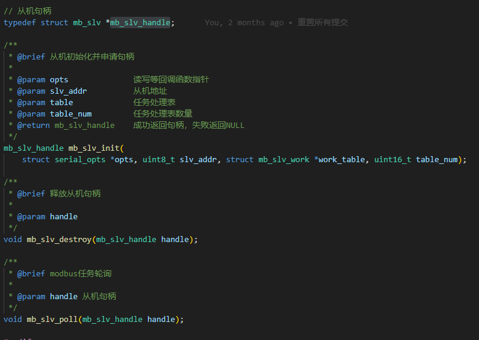
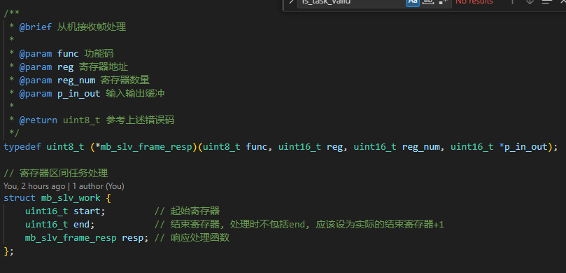

# 如何使用Modbus从机协议组件
 - 本框架已提供了标准Modbus协议组件源码，在protocol/modbus/modbus_slave.c中
 - 此协议不和应用逻辑和任何平台(包括本框架)耦合,只需提供对应的注册回调即可使用
 - 只需使用协议提供的三个接口即可完成从机的功能实现，如图所示

 - 串口回调指针定义如下
```c
struct serial_opts {
	modbus_serial_init f_init;			   // 串口初始化函数指针
	modbus_serial_write f_write;		   // 串口写函数指针
	modbus_serial_read f_read;			   // 串口读函数指针
	modbus_serial_dir_ctrl f_dir_ctrl;	   // 串口方向控制函数指针
	modbus_serial_check_send f_check_over; // 判断是否发送完成
};
```
 - 任务处理表定义如下


## 1. 485串口驱动编写
- 在项目自己新建的驱动文件中新建驱动文件， 如`rs485_driver.c`
- 参考[驱动模板](../driver/README.md)的编写方法
- 本案例使用DMA+串口作为底层发送方式(注: 当前由于开发板的设计特殊，在硬件上使用单线进行485总线收发，请根据自己实际情况修改)
- 参考代码如下：
```c
#include <stdbool.h>
#include <stdint.h>
#include <stdlib.h>
#include <string.h>

#include "driver/driver.h" /* 必要的头文件 */
#include "utils/queue.h"   /* 环形队列 */

#include "gd32f30x.h"

static const char rs485_name[] = "rs485"; /* 确保此设备名唯一 */
static int rs485_open(struct drv_file *file);
static int rs485_close(struct drv_file *file);
static int rs485_ioctl(struct drv_file *file, int cmd, void *arg);
static size_t rs485_read(struct drv_file *file, uint8_t *buf, size_t len, size_t *offset);
static size_t rs485_write(struct drv_file *file, uint8_t *buf, size_t len, size_t *offset);

#define rs485_TX_BUF_SIZE (512)
#define rs485_RX_BUF_SIZE (256)

// 日志设备结构体
struct rs485_dev {
	uint8_t tx_buf[rs485_TX_BUF_SIZE]; // 发送缓冲区
	uint8_t rx_buf[rs485_RX_BUF_SIZE]; // 接收缓冲区
	struct queue_info rx_queue;		   // 接收队列
	bool tx_over;					   // 发送完成标志位
	bool is_opened;					   // 打开标志位
	size_t pre_idx;					   // DMA上一次索引
};

// 打开设备
static int rs485_open(struct drv_file *file)
{
	if (file->is_opened)
		return DRV_ERR_OCCUPIED;

	file->is_opened = true;

	return DRV_ERR_NONE;
}

// 关闭设备
static int rs485_close(struct drv_file *file)
{
	file->is_opened = false;

	return DRV_ERR_NONE;
}

// 获取发送完成状态
static int rs485_ioctl(struct drv_file *file, int cmd, void *arg)
{
	if (!file->is_opened)
		return DRV_ERR_UNAVAILABLE;

	int ret = DRV_ERR_INVALID;
	struct rs485_dev *rs485 = file->private; // 初始化的时候已经设置了私有数据这里可以直接拿到

#define RS485_DIR_RX_CMD (0) // 切换到接收模式
#define RS485_DIR_TX_CMD (1) // 切换到发送模式
#define RS485_CHECK_OVER (2) // 获取发送完成状态

	switch (cmd) {
	case RS485_DIR_RX_CMD:
		gpio_bit_write(GPIOG, GPIO_PIN_15, RESET);
		usart_receive_config(USART0, USART_RECEIVE_ENABLE);
		usart_transmit_config(USART0, USART_TRANSMIT_DISABLE);
		ret = DRV_ERR_NONE;
		break;

	case RS485_DIR_TX_CMD:
		gpio_bit_write(GPIOG, GPIO_PIN_15, SET);
		usart_receive_config(USART0, USART_RECEIVE_DISABLE);
		usart_transmit_config(USART0, USART_TRANSMIT_ENABLE);
		ret = DRV_ERR_NONE;
		break;

	case RS485_CHECK_OVER:
		*(bool *)arg = rs485->tx_over;
		ret = DRV_ERR_NONE;
		break;

	default:
		ret = DRV_ERR_INVALID;
		break;
	}

	return ret;
}

// 读数据
static size_t rs485_read(struct drv_file *file, uint8_t *buf, size_t len, size_t *offset)
{
	if (!file->is_opened)
		return 0;

	struct rs485_dev *rs485 = file->private; // 初始化的时候已经设置了私有数据这里可以直接拿到

	// DAM的Buffer就是队列初始化的Buffer，所以直接从队列中取数据即可

	return queue_get(&rs485->rx_queue, buf, len); /* 返回实际取到的数据长度 */
}

// 写数据
static size_t rs485_write(struct drv_file *file, uint8_t *buf, size_t len, size_t *offset)
{
	if (!file->is_opened)
		return 0;

	struct rs485_dev *rs485 = file->private; // 初始化的时候已经设置了私有数据这里可以直接拿到

	// 还在发送中直接返回
	if (!rs485->tx_over)
		return 0;

	rs485->tx_over = false; // 重新置为发送中

	// DMA发送数据
	memcpy(rs485->tx_buf, buf, len);
	dma_channel_disable(DMA0, DMA_CH3);
	dma_transfer_number_config(DMA0, DMA_CH3, len);
	dma_channel_enable(DMA0, DMA_CH3);

	return len; /* 返回实际发送的数据长度 */
}

// 设备操作接口
static const struct file_operations rs485_opts = {
	.close = rs485_close,
	.ioctl = rs485_ioctl,
	.open = rs485_open,
	.read = rs485_read,
	.write = rs485_write,
};

// DMA发送完成中断处理
void DMA0_Channel3_IRQHandler(void)
{
	static struct rs485_dev *rs485 = NULL;
	if (rs485 == NULL) {
		rs485 = get_dev_private("rs485"); // 通过接口获取私有数据, 确保只查询一次
		if (rs485 == NULL)
			return;
	}

	if (dma_interrupt_flag_get(DMA0, DMA_CH3, DMA_INT_FLAG_FTF) != RESET) {
		rs485->tx_over = true;

		dma_interrupt_flag_clear(DMA0, DMA_CH3, DMA_INT_FLAG_FTF);
	}
}

// USART接收超时中断处理
void USART0_IRQHandler(void)
{
	static struct rs485_dev *rs485 = NULL;
	if (rs485 == NULL) {
		rs485 = get_dev_private("rs485"); // 通过接口获取私有数据, 确保只查询一次
		if (rs485 == NULL)
			return;
	}

	if (usart_interrupt_flag_get(USART0, USART_INT_FLAG_RT) != RESET) {
		uint32_t remain_cnt = dma_transfer_number_get(DMA0, DMA_CH4);
		size_t cur_pos = rs485_RX_BUF_SIZE - remain_cnt;
		size_t cur_receive; // 计算接收的数据长度

		if (cur_pos >= rs485->pre_idx)
			cur_receive = cur_pos - rs485->pre_idx;
		else
			cur_receive = rs485_RX_BUF_SIZE - rs485->pre_idx + cur_pos; // 环形队列溢出

		queue_advance_wr(&rs485->rx_queue, cur_receive); // 更新队列的写指针
		rs485->pre_idx = cur_pos;

		usart_interrupt_flag_clear(USART0, USART_INT_FLAG_RT);
	}
}

// 设备驱动初始化
static bool rs485_driver_init(struct drv_device *dev)
{
	if (!dev)
		return false;

	struct rs485_dev *rs485 = calloc(1, sizeof(struct rs485_dev)); // 申请结构体
	if (!rs485)
		return false;
	rs485->tx_over = true; // 发送完成标志位

	// 串口 + DMA 的初始化
	rcu_periph_clock_enable(RCU_GPIOB);
	rcu_periph_clock_enable(RCU_GPIOG);

	gpio_init(GPIOB, GPIO_MODE_AF_OD, GPIO_OSPEED_50MHZ, GPIO_PIN_6); // PB6 发送/收发
	gpio_pin_remap_config(GPIO_USART0_REMAP, ENABLE); // 重映射

	gpio_init(GPIOG, GPIO_MODE_OUT_PP, GPIO_OSPEED_50MHZ, GPIO_PIN_15); // PG15 方向控制

	rcu_periph_clock_enable(RCU_USART0);
	usart_baudrate_set(USART0, 115200);

	usart_receive_config(USART0, USART_RECEIVE_ENABLE);	   // 使能接收
	usart_transmit_config(USART0, USART_TRANSMIT_DISABLE); // 禁止发送
	usart_halfduplex_enable(USART0);					   // 半双工模式

	usart_interrupt_enable(USART0, USART_INT_RT);		 /* 超时中断 */
	usart_receiver_timeout_enable(USART0);				 /* 使能接收超时 */
	usart_receiver_timeout_threshold_config(USART0, 10); /* 超时阈值设置10 */
	nvic_irq_enable(USART0_IRQn, 0, 0);
	usart_enable(USART0);

	rcu_periph_clock_enable(RCU_DMA0);
	dma_deinit(DMA0, DMA_CH3);
	dma_parameter_struct dma_param;
	dma_struct_para_init(&dma_param);
	dma_param.periph_addr = (uint32_t)(&USART_DATA(USART0));
	dma_param.periph_width = DMA_PERIPHERAL_WIDTH_8BIT;
	dma_param.memory_addr = (uint32_t)rs485->tx_buf;
	dma_param.memory_width = DMA_MEMORY_WIDTH_8BIT;
	dma_param.number = rs485_TX_BUF_SIZE;
	dma_param.priority = DMA_PRIORITY_ULTRA_HIGH;
	dma_param.periph_inc = DMA_PERIPH_INCREASE_DISABLE;
	dma_param.memory_inc = DMA_MEMORY_INCREASE_ENABLE;
	dma_param.direction = DMA_MEMORY_TO_PERIPHERAL;
	usart_dma_transmit_config(USART0, USART_TRANSMIT_DMA_ENABLE);
	dma_init(DMA0, DMA_CH3, &dma_param);
	dma_interrupt_enable(DMA0, DMA_CH3, DMA_INT_FLAG_FTF);
	nvic_irq_enable(DMA0_Channel3_IRQn, 0, 1);

	dma_param.memory_addr = (uint32_t)rs485->rx_buf; // 接收缓冲
	dma_param.direction = DMA_PERIPHERAL_TO_MEMORY;
	dma_param.number = rs485_RX_BUF_SIZE;
	dma_deinit(DMA0, DMA_CH4);
	dma_init(DMA0, DMA_CH4, &dma_param);
	dma_circulation_enable(DMA0, DMA_CH4); /* 使能环形缓冲 */
	usart_dma_receive_config(USART0, USART_RECEIVE_DMA_ENABLE);
	dma_channel_enable(DMA0, DMA_CH4);

	queue_init(&rs485->rx_queue, sizeof(uint8_t), rs485->rx_buf, rs485_RX_BUF_SIZE); /* 初始化接收队列 */

	set_dev_private(dev, rs485); // 设置私有数据 以便于其他接口获取

	return true;
}

// 通过宏定义导出驱动(在 virtual_os_init 函数中会被调用)
EXPORT_DRIVER(rs485_driver_probe)
void rs485_driver_probe(void)
{
	driver_register(rs485_driver_init, &rs485_opts, rs485_name); // 调用注册接口
}
```

## 2. RS485应用代码编写
 - 在`app/src`文件夹中新建文件,如 `app_rs485_slave.c`
 - 在`app/inc`文件夹中新建文件,如 `app_rs485_slave.h`
 - 编写了串口驱动后，即可使用`VirtualOS/dal/dal_opt.h`中提供的接口,其中的每个
   接口都与驱动的`struct file_operations`一一对应
 - 该应用案例中具体的协议定义参考[自定义协议](../self_protocol.md)
 - 参考代码如下：
```c
// app_rs485_slave.h

#ifndef __APP_RS485_SLAVE_H__
#define __APP_RS485_SLAVE_H__

#define APP_RS485_SLAVE_TASK_PERIOD_MS (10)

void app_rs485_slave_init(void);
void app_rs485_slave_task(void);

#endif /* __APP_RS485_SLAVE_H__ */
```

```c
// app_rs485_slave.c

#include <stdint.h>
#include <string.h>

#include "protocol/modbus/modbus_slave.h" // 从机组件

#include "dal/dal_opt.h" // 文件接口

#include "app_modbus_def.h"	 // 自定义协议
#include "app_rs485_slave.h" // 应用头文件

// IOCTL命令
#define RS485_DIR_RX_CMD (0) // 切换到接收模式
#define RS485_DIR_TX_CMD (1) // 切换到发送模式
#define RS485_CHECK_OVER (2) // 获取发送完成状态

struct app_485_dev {
	const char *name;	// 设备名称
	int fd;				// 文件描述符
	uint8_t slave_addr; // 从机地址
};

// RS485设备实例
static struct app_485_dev dev = {
	.name = "rs485",
	.fd = -1,
	.slave_addr = 0x06,
};

// 检查是否发送完成
static bool rs485_check_over(void)
{
	bool status = false;

	int ret = dal_ioctl(dev.fd, RS485_CHECK_OVER, &status);
	if (ret != DAL_ERR_NONE)
		return false;

	return status;
}

// 切换发送接收模式
static void rs485_dir_ctrl(enum modbus_serial_dir ctrl)
{
	if (ctrl == modbus_serial_dir_rx_only) {
		dal_ioctl(dev.fd, RS485_DIR_RX_CMD, NULL);
	} else if (ctrl == modbus_serial_dir_tx_only) {
		dal_ioctl(dev.fd, RS485_DIR_TX_CMD, NULL);
	} else {
		return;
	}
}

// RS485设备初始化
static bool rs485_485_init(void)
{
	dev.fd = dal_open(dev.name);
	return dev.fd >= 0;
}

// RS485设备读
static size_t rs485_485_read(uint8_t *buf, size_t len)
{
	return dal_read(dev.fd, buf, len);
}

// RS485设备写
static size_t rs485_485_write(uint8_t *buf, size_t len)
{
	return dal_write(dev.fd, buf, len);
}

// 回调指针结构体
static struct serial_opts opts = {
	.f_check_over = rs485_check_over,
	.f_dir_ctrl = rs485_dir_ctrl,
	.f_init = rs485_485_init,
	.f_read = rs485_485_read,
	.f_write = rs485_485_write,
};

// 设备信息处理回调接口
static uint8_t dev_info_handler(uint8_t func, uint16_t reg, uint16_t reg_num, uint16_t *p_in_out)
{
	int ret = MODBUS_RESP_ERR_BUSY;

	uint16_t *p_addr = get_dev_info(reg);

	switch (func) {
	case MODBUS_FUN_RD_REG_MUL:
		memcpy(p_in_out, p_addr, reg_num << 1);
		ret = MODBUS_RESP_ERR_NONE;
		break;
	case MODBUS_FUN_WR_REG_MUL:
		memcpy(p_addr, p_in_out, reg_num << 1);
		ret = MODBUS_RESP_ERR_NONE;
		break;
	default:
		ret = MODBUS_RESP_ERR_FUNC;
		break;
	}

	return ret;
}

// 所有回调处理表
static struct mb_slv_work work_table[] = {
	{
		.start = DEV_INFO_HW_VER,
		.end = DEV_INFO_END,
		.resp = dev_info_handler,
	},
};

// 从机句柄
static mb_slv_handle handle = NULL;

void app_rs485_slave_init(void)
{
	// 从机初始化
	handle = mb_slv_init(&opts, dev.slave_addr, work_table, sizeof(work_table) / sizeof(work_table[0]));
}

void app_rs485_slave_task(void)
{
	uint16_t *p_sw_ver = get_dev_info(DEV_INFO_SW_VER);
	(*p_sw_ver)++; // 测试代码

	// 从机任务处理
	mb_slv_poll(handle);
}
```

### 3. 在主函数中创建日志任务
 - 参考代码如下
```c
#include <stdint.h>
#include <stddef.h>

#include "utils/stimer.h"

#include "systick.h"

#include "app_led.h"
#include "app_rs485_slave.h"

int main(void)
{
	app_system_init(); // 初始化VirtualOS和调度器

	stimer_task_create(app_led_init, NULL, 0);									  // 创建LED任务
	stimer_task_create(app_rs485_slave_init, app_rs485_slave_task, APP_RS485_SLAVE_TASK_PERIOD_MS); // modbus从机任务

	stimer_start(); // 启动调度器(死循环)

	return 0;
}
```