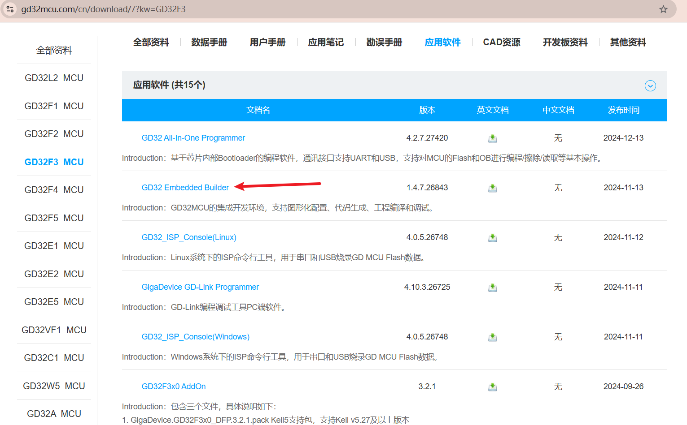
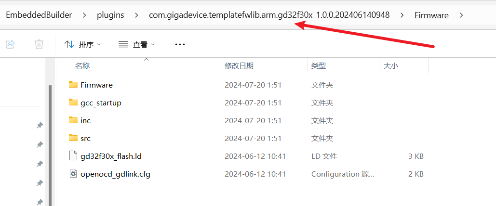
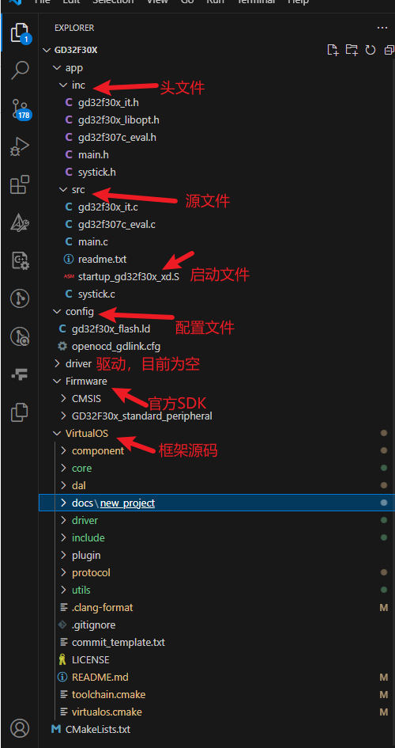
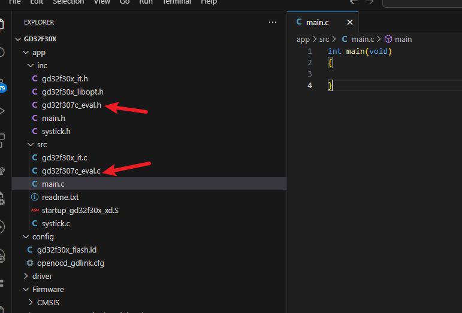
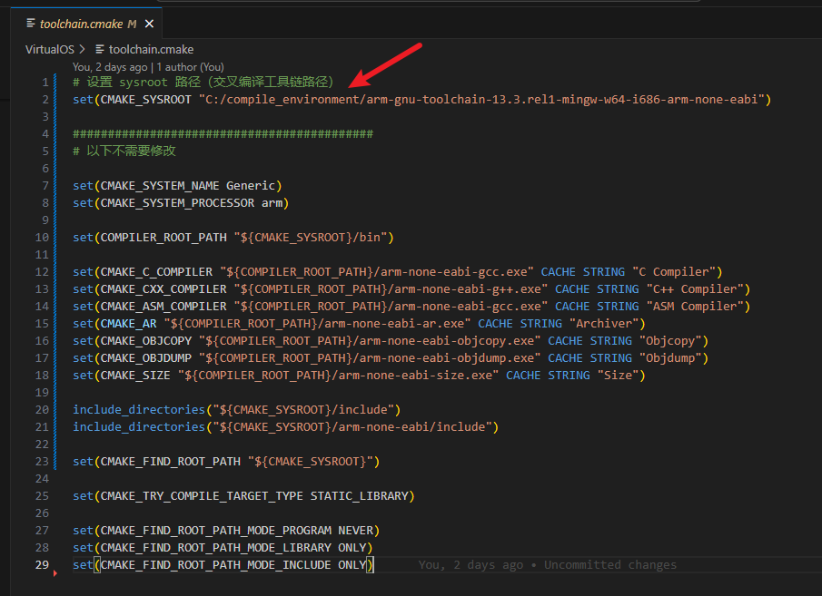
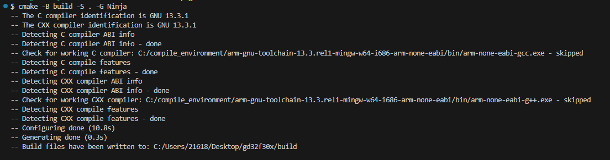
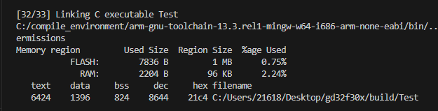
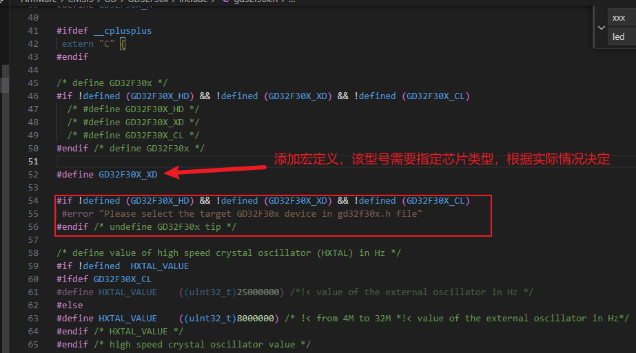
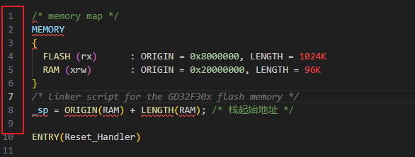
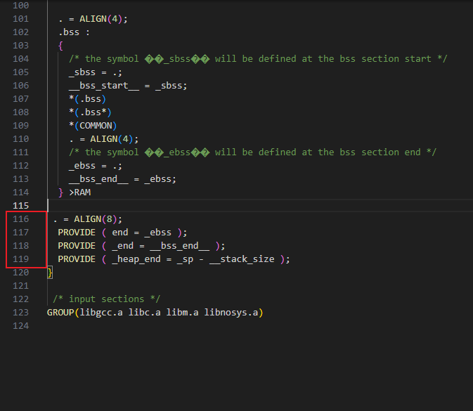

# 点灯案例, 以GD32F30x芯片为例(重新更新于2024-12-26)

## 1. 从[GD官网](https://www.gd32mcu.com/cn/download/7?kw=GD32F3)中下载SDK，并找到GD32F30x的路径



## 2. 新建文件夹(以gd32f30x为例)
 - 拷贝框架源码`VirtualOS`文件夹到该文件夹下
 - 新建`app`文件夹，未来在此添加应用代码，复制SDK中的头文件(inc)和源文件(src)
 - 将启动文件也复制到`app/src`文件夹下
 - 新建`driver`文件夹，未来在此添加驱动代码
 - 新建`config`文件夹存放配置文件，例如链接文件和openocd配置文件
 - 新建`CMakeLists.txt`文件，用于编写项目构建配置
 - 最终效果如图所示：


## 3. 删除官方案例代码
 - 清空`main.c`文件
 - 删除图中两个文件`gd32f307c_eval.c/h`


## 4. 修改交叉编译器路径
 - 修改`VirtualOS/toolchain.cmake`中的编译器根路径为自己本地路径(首页已指定了下载链接)，如图所示：

  
## 5. 修改CMakeLists.txt文件
 - 关键修改部分已经用```!!!```标注，其他部分可以不用修改, 请勿随意修改配置顺序, 实际使用时请根据自己的项目修改
 - 具体参考代码如下所示:
```CMakeLists.txt
cmake_minimum_required(VERSION 3.21) # cmake 版本

set(CMAKE_EXPORT_COMPILE_COMMANDS ON) # 生成 compile_commands.json

set(CMAKE_TOOLCHAIN_FILE ${CMAKE_CURRENT_LIST_DIR}/VirtualOS/toolchain.cmake) # 交叉编译工具链路径

# !!! 项目名 + 语言类型
project(Test C ASM)

include(${CMAKE_CURRENT_LIST_DIR}/VirtualOS/virtualos.cmake) # 导入 VirtualOS 框架配置文件

# !!! 设置内核
set(CMAKE_SYSTEM_PROCESSOR cortex-m4)

set(CMAKE_C_FLAGS "${CMAKE_C_FLAGS} -mcpu=${CMAKE_SYSTEM_PROCESSOR} -mthumb") # 编译选项

# !!! 项目头文件路径
set(PROJECT_INCLUDE_DIRS
    ${CMAKE_CURRENT_LIST_DIR}/app/inc/
    ${CMAKE_CURRENT_LIST_DIR}/Firmware/CMSIS/
    ${CMAKE_CURRENT_LIST_DIR}/Firmware/CMSIS/GD/GD32F30x/include/
    ${CMAKE_CURRENT_LIST_DIR}/Firmware/GD32F30X_standard_peripheral/include/
)

# !!! 项目源文件路径
file(GLOB_RECURSE PROJECT_SOURCES
    ${CMAKE_CURRENT_LIST_DIR}/app/src/*.c
    ${CMAKE_CURRENT_LIST_DIR}/app/src/*.S
    ${CMAKE_CURRENT_LIST_DIR}/Firmware/CMSIS/GD/GD32F30x/Source/*.c
    ${CMAKE_CURRENT_LIST_DIR}/Firmware/GD32F30X_standard_peripheral/Source/*.c
    ${CMAKE_CURRENT_LIST_DIR}/driver/*.c
)

# !!!链接脚本
set(LINKER_SCRIPT ${CMAKE_CURRENT_LIST_DIR}/config/gd32f30x_flash.ld)

# 编译选项
set(COMPILER_FLAGS
    -mcpu=${CMAKE_SYSTEM_PROCESSOR}
    -mthumb
    -mthumb-interwork
    -ffunction-sections
    -fdata-sections
    -fno-common
    -fmessage-length=0
)

# 设置输出目录名  
set(out_dir_name output)

# 创建输出目录
file(MAKE_DIRECTORY ${CMAKE_BINARY_DIR}/${out_dir_name})

# 链接选项
add_link_options(
    -Wl,-Map=${CMAKE_BINARY_DIR}/${out_dir_name}/${PROJECT_NAME}.map
    -Wl,--print-memory-usage
    -Wl,--gc-sections
    -mcpu=${CMAKE_SYSTEM_PROCESSOR}
    -mthumb
    -mthumb-interwork
    -T ${LINKER_SCRIPT}
)

add_executable(${PROJECT_NAME} ${PROJECT_SOURCES})  # 可执行文件

target_link_libraries(${PROJECT_NAME} PRIVATE VirtualOS) # 链接 VirtualOS 静态库

target_include_directories(${PROJECT_NAME} PRIVATE ${PROJECT_INCLUDE_DIRS}) # 项目包含头文件

target_compile_options(${PROJECT_NAME} PRIVATE ${COMPILER_FLAGS}) # 编译选项

set(HEX_FILE ${CMAKE_BINARY_DIR}/output/${PROJECT_NAME}.hex) # 设置 HEX 文件路径
set(BIN_FILE ${CMAKE_BINARY_DIR}/output/${PROJECT_NAME}.bin) # 设置 BIN 文件路径

# 生成 .hex 和 .bin 文件 显示编译大小
add_custom_command(TARGET ${PROJECT_NAME} POST_BUILD
    COMMAND ${CMAKE_OBJCOPY} -Oihex $<TARGET_FILE:${PROJECT_NAME}> ${HEX_FILE}
    COMMAND ${CMAKE_OBJCOPY} -Obinary $<TARGET_FILE:${PROJECT_NAME}> ${BIN_FILE}
    COMMAND ${CMAKE_SIZE} --format=berkeley $<TARGET_FILE:${PROJECT_NAME}>
    COMMAND ${CMAKE_OBJDUMP} -h $<TARGET_FILE:${PROJECT_NAME}> > ${CMAKE_BINARY_DIR}/output/${PROJECT_NAME}.sections
)
```

## 6. 给框架提供调度定时器
 - 以使用`systick`为例，修改`app/src/systick.c`和`app/inc/systick.h`文件，具体参考代码如下所示:
 - 核心在于调用`virtual_os_init`函数，使框架可以依据提供的定时器进行定时计数调度
 - 注意删除中断文件`gd32f30x_it.c`中的`SysTick_Handler`函数，我们会在此文件重写
```c
// systick.h

#ifndef _SYSTICK_H_
#define _SYSTICK_H_

#include <stdint.h>

// 系统时钟, 调度初始化
void app_system_init(void);

// 死延时(强烈推荐减少项目中死延时的使用)
void delay_one_tick(uint32_t tick);

#endif /* _SYSTICK_H_ */
```

```c
// systick.c
#include <stdint.h>
#include <stdlib.h>

#include "gd32f30x.h"
#include "systick.h"

#include "utils/stimer.h" // 调度组件
#include "core/virtualos_run.h" // 框架初始化

// 延时计数器
static volatile uint32_t delay_tick = 0U;

// 超时回调函数
static stimer_timeout_process stimer_cb = NULL;

/**
 * @brief 系统时钟初始化
 * 
 * @param hz 频率
 */
static void systick_config(uint32_t hz)
{
	if (SysTick_Config(SystemCoreClock / hz)) {
		while (1) {
		}
	}
	NVIC_SetPriority(SysTick_IRQn, 0x00U);
}

/**
 * @brief 调度时钟初始化
 * 
 * @param period_ms 周期(ms) 这个值由VirtualOS/utils/stimer.h中 STIMER_PERIOD_PER_TICK_MS 定义
 * @param f_timeout 超时回调函数，在中断中调用
 */
static void _stimer_base_init(uint32_t period_ms, stimer_timeout_process f_timeout)
{
	uint32_t hz = 1000 / period_ms;
	systick_config(hz);
	stimer_cb = f_timeout;
}

/**
 * @brief 定时器启动，systick这里不需要
 * 
 */
static void _stimer_base_start(void)
{
	/* empty function */
}

// 回调函数
static struct timer_port m_tmr = {
	.f_init = _stimer_base_init,
	.f_start = _stimer_base_start,
};

// 中断函数
void SysTick_Handler(void)
{
    // 死延时
	if (delay_tick) {
		delay_tick--;
		return;
	}

    // 无死延时时，调用调度器回调
	if (stimer_cb) {
		stimer_cb();
	}
}

/*********************API*********************/

void app_system_init(void)
{
	// 提供systick作为系统时钟
	virtual_os_init(&m_tmr);
}

/**
 * @brief 死延时 TIck与初始化的频率有关
 * 
 * @param tick 
 */
void delay_one_tick(uint32_t tick)
{
	delay_tick = tick;
    while(delay_tick);
}
```

- 在mian.c中调用`app_system_init()`初始化`VirtualOS`和调度器
```c
#include "systick.h"

int main(void)
{
    app_system_init(); // 初始化VirtualOS和调度器
}
```

## 7. 编写LED驱动代码
 - 在新建的driver文件中新建文件,如 `led_driver.c`
 - 参考[驱动编写模板](../driver/README.md)
 - 修改后的代码如下所示
```c
#include <stdbool.h>
#include "driver/driver.h" /* 驱动注册头文件 */

#include "gd32f30x.h"

static const char led_name[] = "led"; /* 确保此设备名项目中唯一 */
static int led_open(struct drv_file *file);
static int led_close(struct drv_file *file);
static int led_ioctl(struct drv_file *file, int cmd, void *arg);
static size_t led_read(struct drv_file *file, uint8_t *buf, size_t len, size_t *offset);
static size_t led_write(struct drv_file *file, uint8_t *buf, size_t len, size_t *offset);

static int led_open(struct drv_file *file)
{
	if (file->is_opened)
		return DRV_ERR_OCCUPIED;

	/* 打开外设 */

	file->is_opened = true;

	return DRV_ERR_NONE;
}

static int led_close(struct drv_file *file)
{
	/* 关闭外设 例如进入低功耗 */

	file->is_opened = false;

	return DRV_ERR_NONE;
}

static int led_ioctl(struct drv_file *file, int cmd, void *arg)
{
	if (!file->is_opened)
		return DRV_ERR_UNAVAILABLE;

	/* 除读写外的控制命令处理 */

	return DRV_ERR_NONE;
}

static size_t led_read(struct drv_file *file, uint8_t *buf, size_t len, size_t *offset)
{
	if (!file->is_opened)
		return 0;

	/* 读取外设数据 */

	return 0; /* 读取成功返回实际读取的字节数 */
}

static size_t led_write(struct drv_file *file, uint8_t *buf, size_t len, size_t *offset)
{
	if (!file->is_opened)
		return 0;

	gpio_bit_write(GPIOE, GPIO_PIN_5, (*buf ? SET : RESET));

	return 1; /* 写入成功返回实际写入的字节数 */
}

// 设备操作接口
static const struct file_operations led_opts = {
	.close = led_close,
	.ioctl = led_ioctl,
	.open = led_open,
	.read = led_read,
	.write = led_write,
};

// 设备驱动初始化
static bool led_driver_init(struct drv_device *dev)
{
	/* 外设初始化 */
	rcu_periph_clock_enable(RCU_GPIOE);
	gpio_init(GPIOE, GPIO_MODE_OUT_PP, GPIO_OSPEED_50MHZ, GPIO_PIN_5);

	return true;
}

// 通过宏定义导出驱动(在 virtual_os_init 函数中会被调用)
EXPORT_DRIVER(led_driver_probe)
void led_driver_probe(void)
{
	driver_register(led_driver_init, &led_opts, led_name); // 调用注册接口
}
```

## 8. 编写LED应用代码
 - 在`app/src`文件夹中新建文件,如 `app_led.c`
 - 在`app/inc`文件夹中新建文件,如 `app_led.h`
 - 编写了LED驱动后，即可使用`VirtualOS/dal/dal_opt.h`中提供的接口,其中的每个
   接口都与驱动的`struct file_operations`一一对应
 - 参考代码如下
```c
// app_led.h
#ifndef _APP_LED_H
#define _APP_LED_H

#define APP_LED_TASK_PERIOD_MS (50) // LED任务周期 50ms

void app_led_init(void); // LED初始化
void app_led_task(void); // LED任务

#endif
```

```c
// app_led.c 50ms翻转一次LED

#include "app_led.h"
#include "dal/dal.h"

static int fd = -1; // 文件描述符

void app_led_init(void)
{
	fd = dal_open("led"); // 打开LED设备 这里的设备名和驱动中保持一致
}

void app_led_task(void)
{
	static uint8_t level = 0;

	if (fd > 0)
		dal_write(fd, &level, sizeof(level)); // 每次任务翻转一次电平

	level ^= 1;
}
```

## 9. 编写main.c文件
 - 编写main.c文件，在main函数中调用接口创建LED任务
 - 参考代码如下
```c
#include <stdint.h>

#include "utils/stimer.h"

#include "systick.h"
#include "app_led.h"

int main(void)
{
	app_system_init(); // 初始化VirtualOS和调度器

	stimer_task_create(app_led_init, app_led_task, APP_LED_TASK_PERIOD_MS); // 创建LED任务

	stimer_start(); // 启动调度器(死循环)

	return 0;
}
```

## 10. 编译运行
1. 启动终端, 执行如下命令
 - `cmake -B build -S . -G Ninja`
 - -B build 代表新建构建文件夹为build
 - -S . 代表CMakeLists.txt文件在当前目录
 - -G Ninja 代表使用Ninja作为构建工具
 - 成功效果如下


2. 编译运行
 - cmake --build build
 - --build 为编译命令 后面跟着编译文件夹名
 - 该命令会编译整个工程将编译生成的可执行文件拷贝到build目录下的output文件夹中(output在CMakeLists.txt中已经)
 - 最终编译成功结果如下


 - 以下为`GD32F30x`需要额外修改的地方，其他平台以及芯片类型请自行根据错误修改
 - 当前工程直接编译会出错, 修改需要修改官方SDK中的`gd32f30x.h`文件, 添加一个宏定义

 - 修改官方的链接文件`gd32f30x_flash.ld`的芯片FLASH与RAM定义，如下所示

 - 将最下面的栈定义替换如下所示

 - 最终文件为如下所示
```ld
/* memory map */
MEMORY
{
  FLASH (rx)      : ORIGIN = 0x8000000, LENGTH = 1024K
  RAM (xrw)       : ORIGIN = 0x20000000, LENGTH = 96K
}

_sp = ORIGIN(RAM) + LENGTH(RAM); /* 栈起始地址 */

ENTRY(Reset_Handler)

SECTIONS
{
  __stack_size = DEFINED(__stack_size) ? __stack_size : 2K;
  
/* ISR vectors */
  .vectors :
  {
    . = ALIGN(4);
    KEEP(*(.vectors))
    . = ALIGN(4);
    __Vectors_End = .;
    __Vectors_Size = __Vectors_End - __gVectors;
  } >FLASH

  .text :
  {
    . = ALIGN(4);
    *(.text)
    *(.text*)
    *(.glue_7) 
    *(.glue_7t)
    *(.eh_frame)

    KEEP (*(.init))
    KEEP (*(.fini))

    . = ALIGN(4);
    /* the symbol ��_etext�� will be defined at the end of code section */
    _etext = .;
  } >FLASH

  .rodata :
  {
    . = ALIGN(4);
    *(.rodata)
    *(.rodata*)
    . = ALIGN(4);
  } >FLASH

   .ARM.extab :
  { 
     *(.ARM.extab* .gnu.linkonce.armextab.*) 
  } >FLASH
  
    .ARM : {
    __exidx_start = .;
    *(.ARM.exidx*)
    __exidx_end = .;
    } >FLASH

  .ARM.attributes : { *(.ARM.attributes) } > FLASH

  .preinit_array :
  {
    PROVIDE_HIDDEN (__preinit_array_start = .);
    KEEP (*(.preinit_array*))
    PROVIDE_HIDDEN (__preinit_array_end = .);
  } >FLASH
  
  .init_array :
  {
    PROVIDE_HIDDEN (__init_array_start = .);
    KEEP (*(SORT(.init_array.*)))
    KEEP (*(.init_array*))
    PROVIDE_HIDDEN (__init_array_end = .);
  } >FLASH
  
  .fini_array :
  {
    PROVIDE_HIDDEN (__fini_array_start = .);
    KEEP (*(.fini_array*))
    KEEP (*(SORT(.fini_array.*)))
    PROVIDE_HIDDEN (__fini_array_end = .);
  } >FLASH

  /* provide some necessary symbols for startup file to initialize data */
  _sidata = LOADADDR(.data);
  .data :
  {
    . = ALIGN(4);
    /* the symbol ��_sdata�� will be defined at the data section end start */
    _sdata = .;
    *(.data)
    *(.data*)
    . = ALIGN(4);
    /* the symbol ��_edata�� will be defined at the data section end */
    _edata = .;
  } >RAM AT> FLASH

  . = ALIGN(4);
  .bss :
  {
    /* the symbol ��_sbss�� will be defined at the bss section start */
    _sbss = .;
    __bss_start__ = _sbss;
    *(.bss)
    *(.bss*)
    *(COMMON)
    . = ALIGN(4);
    /* the symbol ��_ebss�� will be defined at the bss section end */
    _ebss = .;
    __bss_end__ = _ebss;
  } >RAM

 . = ALIGN(8);
  PROVIDE ( end = _ebss );
  PROVIDE ( _end = __bss_end__ );
  PROVIDE ( _heap_end = _sp - __stack_size );
}

 /* input sections */
GROUP(libgcc.a libc.a libm.a libnosys.a)
```
- 最终编译成功结果如下


## 11. 设置快捷编译
 - 在根路径下新建.vscode文件夹
 - 在.vscode文件夹下新建`tasks.json`文件
 - 写入如下内容
```json
{
    "version": "2.0.0",
    "tasks": [
        {
            "label": "CMake Build",
            "type": "shell",
            "command": "cmake",
            "args": [
                "--build",
                "."
            ],
            "options": {
                "cwd": "${workspaceFolder}/build" // 编译文件夹路径
            },
            "group": {
                "kind": "build",
                "isDefault": true
            },
            "problemMatcher": []
        }
    ]
}

```

## 12. 下载运行结果

1. 使用OpenOCD
 - 在根路径下新建.vscode文件夹
 - 在.vscode文件夹下新建`launch.json`文件
 - 写入如下内容
```json
{
    "version": "0.2.0",
    "configurations": [
      {
        "name": "Cortex Debug",
        "cwd": "${workspaceFolder}",
        "executable": "${workspaceFolder}/build/Test", // 编译生成的ELF文件
        "request": "launch",
        "type": "cortex-debug",
        "runToEntryPoint": "main",
        "servertype": "openocd",
        "device": "GD32F303ZGT6", // 芯片型号
        "svdPath": "C:/vscode_embeded/EmbeddedBuilder_v1.4.1.23782/EmbeddedBuilder/plugins/com.gigadevice.resources_1.0.0.202406140948/svd/GD32F30x_XD.svd", // SVD文件路径 可查看芯片寄存器信息 在官方SDK中
        "liveWatch": {
          "enabled": true,
          "samplesPerSecond": 1
        },
        "configFiles": [
          "${workspaceFolder}/config/openocd_gdlink.cfg" // openocd配置文件路径
        ],
        "interface": "swd",
        "showDevDebugOutput": "both",
        "toolchainPrefix": "arm-none-eabi",
        "preLaunchTask": "CMake Build" // 调试下载前执行编译任务 第11步的任务名称
      }
    ]
  }
```

2. 使用Jlink
 - 在根路径下新建.vscode文件夹
 - 在.vscode文件夹下新建`launch.json`文件
 - 写入如下内容
```json
{
    "version": "0.2.0",
    "configurations": [
        {
            "name": "Cortex Debug",
            "cwd": "${workspaceFolder}",
            "executable": "${workspaceFolder}/build/Test", // 编译生成的ELF文件
            "request": "launch",
            "type": "cortex-debug",
            "runToEntryPoint": "main",
            "serverpath": "C:/Program Files/SEGGER/JLink_V798a/JLinkGDBServerCL.exe", // JLinkGDBServerCL.exe路径
            "servertype": "jlink",
            "device": "GD32F303ZGT6", /* 芯片型号 */
            "svdPath": "C:/vscode_embeded/EmbeddedBuilder_v1.4.1.23782/EmbeddedBuilder/plugins/com.gigadevice.resources_1.0.0.202406140948/svd/GD32F30x_XD.svd", // SVD文件路径 可查看芯片寄存器信息 在官方SDK中
            "preLaunchTask": "CMake Build",  // 调试下载前执行编译任务 第11步的任务名称
            "liveWatch": {
                "enabled": true,
                "samplesPerSecond": 1
            },
        }
    ]
}
```